Análisis completo del proyecto (arquitectura, seguridad, código, observabilidad, resiliencia, infra, 8+ diagramas)

# Análisis de Proyecto - Nivel ALTO

> **USE FOR**: análisis de trabajo del proyecto (13 fases, semáforo, TOP-5 acciones, diagramas) con salida en chat + `_hilo/`.
> **DO NOT USE FOR**: auditoría arquitectónica **formal con entregables versionados** (MD+HTML en `06_Documentacion/`) o contexto de agente (`--agente`) → usar **`/analisis-arquitectura`**.

> ⚠️ **CRITICAL**: El output DEBE incluir:
> 1. Emojis de colores: 🔴 (crítico) 🟠 (importante) 🟡 (menor)
> 2. Cajas visuales con `┌───┐` `│` `└───┘`
> 3. **SEMÁFORO DE SALUD** del proyecto (verde/amarillo/rojo)
> 4. **TOP 5 ACCIONES PRIORITARIAS** con formato 🎯
> 5. Progreso de fases: `▶ FASE X/13:`
> 6. **EJECUTAR `./.claude/commands/integracion-vs.ps1` AL FINAL**
>
> **VER SECCIÓN "CRITICAL REMINDERS" AL FINAL ANTES DE GENERAR OUTPUT**

## Parámetros Opcionales

| Parámetro | Descripción |
|-----------|-------------|
| `--quick` | ⚡ **Análisis rápido** (reemplaza `/re-analizar`): Solo estructura, dependencias y cambios recientes. NO regenera diagramas. Ideal para post-cambios menores. |
| `--full` | Análisis completo con los 8+ diagramas (default) |
| `--compare` | Incluye tabla comparativa ANTES vs DESPUÉS |
| `--security` | Solo análisis de seguridad (secrets, CVEs, vulnerabilidades) |
| `--backend` | Solo análisis backend (.NET, APIs, BD) |
| `--frontend` | Solo análisis frontend (JS, CSS, componentes) |
| `--infra` | Solo análisis de infraestructura (despliegue, CI/CD, Docker, health checks) |
| `--report` | Genera informe exportable en formato Markdown estructurado en `01_Diseno/Arquitectura/INFORME_ANALISIS.md` con fecha, métricas, semáforos y acciones |

> 💡 **NOTA**: El comando `/re-analizar` está **deprecado**. Usar `/analizar --quick` en su lugar.

---

## IMPORTANTE: Ubicación del Código

⚠️ **BUSCAR CÓDIGO EN `03_Desarrollo/`**

```
MiProyecto/
├── CLAUDE.md
├── .claude/commands/
├── _hilo/
├── 00_Gestion/
├── 01_Diseno/Arquitectura/    ← DIAGRAMAS AQUÍ
├── 03_Desarrollo/             ← ⭐ CÓDIGO FUENTE AQUÍ ⭐
│   └── MiSolucion.sln
└── 06_Documentacion/
```

Si el código NO está en `03_Desarrollo/`:
1. Buscar `.sln` o `.slnx` en raíz
2. Informar al usuario
3. Analizar donde esté el código

> **Nota**: Claude debe buscar tanto archivos `.sln` como `.slnx` (nuevo formato XML disponible en .NET 8+)

---

## Configuración de Exclusiones

### Librerías y Archivos a IGNORAR

```yaml
exclusiones:
  # ═══════════════════════════════════════════════════════════════
  # JAVASCRIPT - Librerías de terceros
  # ═══════════════════════════════════════════════════════════════
  javascript:
    # jQuery y plugins
    - jquery*.js
    - jquery*.min.js
    - jquery-ui*.js
    - jquery.validate*.js
    - jquery.unobtrusive*.js
    
    # Frameworks
    - angular*.js
    - react*.js
    - react-dom*.js
    - vue*.js
    - ember*.js
    - backbone*.js
    
    # Bootstrap
    - bootstrap*.js
    - bootstrap.bundle*.js
    - popper*.js
    
    # Utilidades
    - lodash*.js
    - underscore*.js
    - moment*.js
    - dayjs*.js
    - axios*.js
    - fetch*.js
    
    # Visualización
    - chart*.js
    - d3*.js
    - highcharts*.js
    - plotly*.js
    
    # Data binding
    - knockout*.js
    - ko.*.js
    
    # Templates
    - handlebars*.js
    - mustache*.js
    - ejs*.js
    
    # Otros
    - modernizr*.js
    - polyfill*.js
    - respond*.js
    - html5shiv*.js
    - signalr*.js
    - toastr*.js
    - sweetalert*.js
    - select2*.js
    - datatables*.js
    - tinymce*.js
    - ckeditor*.js
    
  # ═══════════════════════════════════════════════════════════════
  # CSS - Estilos de terceros
  # ═══════════════════════════════════════════════════════════════
  css:
    # Frameworks
    - bootstrap*.css
    - bootstrap*.min.css
    - bulma*.css
    - tailwind*.css
    - foundation*.css
    - materialize*.css
    
    # Reset/Normalize
    - normalize*.css
    - reset*.css
    - sanitize*.css
    
    # Iconos
    - font-awesome*.css
    - fontawesome*.css
    - glyphicons*.css
    - material-icons*.css
    - feather*.css
    
    # Animaciones
    - animate*.css
    - hover*.css
    
    # Componentes
    - select2*.css
    - datatables*.css
    - toastr*.css
    - sweetalert*.css
    
  # ═══════════════════════════════════════════════════════════════
  # CARPETAS - Directorios completos a ignorar
  # ═══════════════════════════════════════════════════════════════
  carpetas:
    - node_modules/
    - bower_components/
    - packages/
    - vendor/
    - vendors/
    - lib/
    - libs/
    - third-party/
    - third_party/
    - external/
    - wwwroot/lib/
    - wwwroot/vendor/
    - Scripts/lib/
    - Scripts/vendor/
    - Content/lib/
    - Content/vendor/
    - assets/vendor/
    - assets/lib/
    - dist/
    - build/
    - bin/
    - obj/
    - .vs/
    - .git/
    - TestResults/
    
  # ═══════════════════════════════════════════════════════════════
  # ARCHIVOS GENERADOS - Minificados, bundles, etc.
  # ═══════════════════════════════════════════════════════════════
  generados:
    - "*.min.js"
    - "*.min.css"
    - "*.bundle.js"
    - "*.bundle.css"
    - "*.compiled.js"
    - "*.map"
    - "*.Designer.cs"
    - "*.generated.cs"
    - "*.g.cs"
    - "*.g.i.cs"
    - "AssemblyInfo.cs"
    - "GlobalSuppressions.cs"
    - "*.designer.vb"
    - "Reference.cs"
    - "Service References/"
```

---

## FASES DEL ANÁLISIS (13 fases)

### FASE 1: Reconocimiento General

**Objetivo**: Mapear estructura completa del proyecto en `03_Desarrollo/`

```
📁 ESTRUCTURA DETECTADA
━━━━━━━━━━━━━━━━━━━━━━

Backend (.NET):
├── [N] proyectos .csproj
├── [M] clases .cs
├── [K] servicios
└── [X] controladores

Frontend:
├── [N] archivos .js (PROPIOS)
├── [M] archivos .css (PROPIOS)
├── [K] vistas .cshtml/.html
└── [X] librerías externas (EXCLUIDAS)

Base de datos:
├── [N] entidades EF
└── [M] migraciones
```

**Identificar tecnologías**:
- Backend: .NET Framework/Core, Entity Framework, Dapper
- Frontend: jQuery, Bootstrap, Angular, React, Vue, Knockout, vanilla JS
- Otros: SignalR, Web API, MVC, Blazor, Razor Pages

**Detectar contenedores Docker** (A9):
- Buscar `Dockerfile`, `.dockerignore`, `docker-compose*.yml`
- Si existe Dockerfile, verificar: multi-stage build, imagen base, puerto expuesto
- Si existe docker-compose, listar servicios definidos
- Reportar en output:
```
Docker:
├── [✅/❌] Dockerfile          [multi-stage: sí/no]
├── [✅/❌] .dockerignore
└── [✅/❌] docker-compose.yml  [N servicios]
```

---

### FASE 2: Inventario de Exclusiones

Antes de analizar, mostrar lo que se excluye:

```
📦 LIBRERÍAS EXTERNAS DETECTADAS (excluidas del análisis)
━━━━━━━━━━━━━━━━━━━━━━━━━━━━━━━━━━━━━━━━━━━━━━━━━━━━━━━

JavaScript:
  ✓ jquery-3.6.0.min.js (198 KB)
  ✓ bootstrap.bundle.min.js (78 KB)
  ✓ knockout-3.5.1.js (65 KB)
  ✓ moment.min.js (52 KB)

CSS:
  ✓ bootstrap.min.css (152 KB)
  ✓ font-awesome.min.css (35 KB)

Carpetas ignoradas:
  ✓ wwwroot/lib/ (45 archivos)
  ✓ Scripts/vendor/ (12 archivos)

━━━━━━━━━━━━━━━━━━━━━━━━━━━━━━━━━━━━━━━━━━━━━━━━━━━━━━━
Total excluido: [X] archivos, [Y] MB
A analizar: [Z] archivos propios
```

---

### FASE 3: Análisis de Seguridad 🔒

**Nivel**: ALTO (escaneo exhaustivo)

#### 3.1 Backend (.NET)

**Buscar en** `03_Desarrollo/**/*.cs`, `03_Desarrollo/**/*.config`, `03_Desarrollo/**/*.json`:

| Severidad | Patrón | Riesgo |
|-----------|--------|--------|
| 🔴 CRÍTICO | Secrets hardcodeados (password, apikey, secret) | Exposición de credenciales |
| 🔴 CRÍTICO | Connection strings con credenciales | Acceso no autorizado |
| 🔴 CRÍTICO | SQL concatenado (no paramétrico) | SQL Injection |
| 🟠 IMPORTANTE | `<compilation debug="true"` | Debug en producción |
| 🟠 IMPORTANTE | `<customErrors mode="Off"` | Información sensible |
| 🟠 IMPORTANTE | CORS: `Access-Control-Allow-Origin: *` | Acceso irrestricto |
| 🟠 IMPORTANTE | JWT sin expiración | Tokens eternos |
| 🟡 MENOR | `validateRequest="false"` | XSS potencial |

#### 3.2 Frontend (JavaScript PROPIO únicamente)

**Buscar en** `03_Desarrollo/**/*.js` EXCLUYENDO librerías:

| Severidad | Patrón | Riesgo |
|-----------|--------|--------|
| 🔴 CRÍTICO | `eval()`, `new Function()` | Ejecución de código |
| 🔴 CRÍTICO | `innerHTML = userInput` | XSS |
| 🔴 CRÍTICO | `document.write()` | XSS |
| 🔴 CRÍTICO | API keys expuestas | Exposición de credenciales |
| 🟠 IMPORTANTE | `localStorage` con datos sensibles | Exposición de datos |
| 🟠 IMPORTANTE | URLs con credenciales embebidas | Credenciales en logs |
| 🟡 MENOR | `console.log()` en producción | Debug en producción |

#### 3.3 Configuración

**Buscar en** `03_Desarrollo/**/appsettings*.json`, `03_Desarrollo/**/web.config`:

| Severidad | Patrón | Riesgo |
|-----------|--------|--------|
| 🔴 CRÍTICO | Credenciales en JSON/config | Exposición |
| 🔴 CRÍTICO | Claves de cifrado hardcodeadas | Seguridad comprometida |
| 🟠 IMPORTANTE | Endpoints internos expuestos | Información interna |
| 🟠 IMPORTANTE | IPs internas visibles | Reconocimiento |

#### 3.4 Secrets en historial Git (A10)

**Ejecutar** `git log --diff-filter=D --name-only -- "*.json" "*.config" "*.env"` para detectar archivos sensibles eliminados.

**Buscar en historial**:
```bash
git log -p --all -S "password" -- "*.json" "*.config" "*.cs"
git log -p --all -S "connectionstring" -- "*.json" "*.config"
```

| Severidad | Hallazgo | Acción |
|-----------|----------|--------|
| 🔴 CRÍTICO | Password/secret encontrado en historial Git | Rotar credencial + `git filter-branch` o BFG |
| 🟠 IMPORTANTE | Archivo .env o secrets.json commiteado (aunque eliminado) | Rotar credencial, añadir a .gitignore |
| 🟡 MENOR | Connection string de desarrollo en historial | Verificar que no es de producción |

> ⚠️ **ADVERTENCIA**: Si se encuentran secrets en historial, mostrar alerta prominente:
> ```
> ┌─────────────────────────────────────────────────────────────────┐
> │ 🔴 ALERTA: SECRETS DETECTADOS EN HISTORIAL GIT                  │
> │ Las credenciales eliminadas del código SIGUEN en el historial.  │
> │ Acción: Rotar credenciales + limpiar historial con BFG Cleaner  │
> └─────────────────────────────────────────────────────────────────┘
> ```

---

### FASE 4: Análisis de Código Backend

**Buscar en** `03_Desarrollo/**/*.cs`

#### Métricas de calidad

| Métrica | Umbral 🔴 | Umbral 🟠 | Umbral 🟡 |
|---------|-----------|-----------|-----------|
| Líneas por clase | >500 LOC | >300 LOC | >200 LOC |
| Líneas por método | >50 LOC | >30 LOC | >20 LOC |
| Parámetros por método | >7 | >5 | >4 |
| Complejidad ciclomática | >15 | >10 | >7 |
| Profundidad de herencia | >5 | >4 | >3 |

#### Code Smells

| Smell | Severidad | Acción |
|-------|-----------|--------|
| God Class (>500 líneas) | 🔴 | Dividir responsabilidades |
| Método largo (>50 líneas) | 🟠 | Extraer métodos |
| Demasiados parámetros (>5) | 🟡 | Usar objeto de parámetros |
| Catch vacío | 🟠 | Loggear o relanzar |
| TODO/HACK/FIXME | 🟡 | Resolver o crear issue |
| Código comentado (>10 líneas) | 🟡 | Eliminar (está en VCS) |
| Magic numbers/strings | 🟡 | Extraer constantes |
| Duplicación (>20 líneas) | 🟠 | Extraer método común |

#### Anti-patterns

| Anti-pattern | Severidad | Solución |
|--------------|-----------|----------|
| Service Locator | 🟠 | Usar DI |
| God Controller (>10 actions) | 🔴 | Dividir |
| N+1 queries | 🟠 | Usar Include/eager loading |
| Catch-all exceptions | 🟠 | Excepciones específicas |
| Anemic Domain Model | 🟡 | Lógica en entidades |

#### Async Antipatterns (A7)

**Buscar en** `03_Desarrollo/**/*.cs`:

| Severidad | Patrón | Riesgo | Solución |
|-----------|--------|--------|----------|
| 🔴 CRÍTICO | `.Result` o `.GetAwaiter().GetResult()` | Deadlock en ASP.NET | Usar `await` |
| 🔴 CRÍTICO | `.Wait()` en código async | Deadlock | Usar `await` |
| 🟠 IMPORTANTE | `async void` (excepto event handlers) | Excepciones no capturables | Cambiar a `async Task` |
| 🟠 IMPORTANTE | Método async sin `CancellationToken` | No cancelable | Añadir parámetro `ct` |
| 🟡 MENOR | `Task.Run()` en ASP.NET | Thread pool innecesario | Usar async directo |
| 🟡 MENOR | `ConfigureAwait(false)` en ASP.NET Core | Innecesario desde .NET Core | Eliminar |

**Regex de búsqueda:**
```
\.Result[^s]          → .Result (no .Results)
\.Wait\(\)            → .Wait()
async\s+void          → async void
Task\.Run\(           → Task.Run en controladores/servicios
```

#### EF Core Performance Patterns (A6)

**Buscar en** `03_Desarrollo/**/*.cs` que usen DbContext:

| Severidad | Patrón | Riesgo | Solución |
|-----------|--------|--------|----------|
| 🟠 IMPORTANTE | Queries sin `AsNoTracking()` en lecturas | Overhead de change tracking | Añadir `.AsNoTracking()` |
| 🟠 IMPORTANTE | Múltiples Includes sin `AsSplitQuery()` | Explosión cartesiana | Usar `.AsSplitQuery()` |
| 🟠 IMPORTANTE | `ToList()` sin paginación en colecciones grandes | Carga de toda la tabla | Usar `.Skip().Take()` |
| 🟡 MENOR | `Select()` cargando entidad completa para pocos campos | Datos innecesarios | Usar proyección con DTO |
| 🟡 MENOR | Sin `Compiled Queries` para consultas frecuentes | Rendimiento | Considerar `EF.CompileAsyncQuery` |

#### Middleware Pipeline Order (A5)

**Buscar en** `03_Desarrollo/**/Program.cs` o `Startup.cs`:

Verificar orden correcto del pipeline (el orden importa):
```
1. UseExceptionHandler / UseDeveloperExceptionPage
2. UseHsts
3. UseHttpsRedirection
4. UseStaticFiles
5. UseRouting
6. UseCors
7. UseAuthentication
8. UseAuthorization
9. UseResponseCaching
10. MapControllers / MapRazorPages / MapBlazorHub
```

| Severidad | Issue | Riesgo |
|-----------|-------|--------|
| 🔴 CRÍTICO | `UseAuthorization` antes de `UseAuthentication` | Auth bypass |
| 🟠 IMPORTANTE | `UseStaticFiles` después de `UseAuthorization` | Archivos estáticos requieren auth |
| 🟠 IMPORTANTE | `UseCors` después de `UseRouting` pero antes de `UseAuthorization` | CORS no aplica |
| 🟡 MENOR | Middleware duplicado | Performance innecesario |

---

### FASE 5: Análisis Frontend (si aplica)

**⏭️ SKIP si no se detectan**: `.js`, `.ts`, `.cshtml`, `.razor` en `03_Desarrollo/`

**Buscar en** `03_Desarrollo/**/*.js`, `03_Desarrollo/**/*.ts`, `03_Desarrollo/**/*.cshtml`:

#### JavaScript (excluyendo librerías)

| Issue | Severidad | Solución |
|-------|-----------|----------|
| `var` en lugar de `let/const` | 🟡 | Migrar a ES6+ |
| Callbacks anidados (>3) | 🟠 | Usar Promises/async |
| Sin manejo de errores AJAX | 🟠 | Añadir .catch/.fail |
| jQuery `.live()`, `.bind()` | 🔴 | Deprecado - Usar `.on()` |
| Variables globales | 🟠 | Usar módulos/IIFE |
| Funciones muy largas (>50 líneas) | 🟠 | Dividir |

#### CSS (excluyendo librerías)

| Issue | Severidad | Solución |
|-------|-----------|----------|
| `!important` excesivo | 🟡 | Revisar cascada |
| Selectores muy anidados (>4) | 🟡 | Simplificar |
| px fijos para responsive | 🟠 | Usar rem/em/% |

#### HTML/Razor/Vistas

| Issue | Severidad | Descripción |
|-------|-----------|-------------|
| Scripts inline extensos (>10 líneas) | 🟠 | Extraer a archivo |
| IDs duplicados | 🔴 | Error HTML |
| Forms sin @Html.AntiForgeryToken() | 🔴 | CSRF vulnerability |
| Alt faltante en img | 🟡 | Accesibilidad |

---

### FASE 6: Evaluación de Conformidad

**Comparar con Golden Standard (Ovillo)**

```
📊 CONFORMIDAD CON PLANTILLA COMILLAS
━━━━━━━━━━━━━━━━━━━━━━━━━━━━━━━━━━━━

Estructura de carpetas:
  ✅ _hilo/           [existe]
  ✅ 00_Gestion/          [existe]
  ⚠️ 01_Diseno/           [parcial]
  ✅ 03_Desarrollo/       [existe]
  ❌ 06_Documentacion/    [falta]
  ❌ 07_UAP/              [falta]

Archivos requeridos:
  ✅ CLAUDE.md
  ✅ ESTADO_PROYECTO.json
  ⚠️ DECISIONES.md        [vacío]
  ❌ DEUDA_TECNICA.md     [falta]

Patrones de código:
  ✅ Inyección de dependencias
  ✅ Repository pattern
  ⚠️ Unit of Work         [parcial]
  ❌ CQRS                  [no aplica]

Convenciones API (A8):
  [✅/❌] ProblemDetails para errores RFC 7807
  [✅/❌] [ProducesResponseType] en endpoints
  [✅/❌] Route constraints ({id:int})
  [✅/❌] Versionado de API (/api/v1/)
  [✅/❌] Paginación estándar (page, pageSize)

━━━━━━━━━━━━━━━━━━━━━━━━━━━━━━━━━━━━
📈 CONFORMIDAD GLOBAL: [X]%
```

**Verificación de convenciones API (A8):**

**Buscar en** `03_Desarrollo/**/*Controller.cs` y `03_Desarrollo/**/Endpoints/**/*.cs`:

| Severidad | Check | Cómo verificar |
|-----------|-------|----------------|
| 🟠 IMPORTANTE | ProblemDetails para errores | Buscar `ProblemDetails` o `RFC 7807` en respuestas de error |
| 🟠 IMPORTANTE | `[ProducesResponseType]` en endpoints | Buscar atributos de documentación en Controllers |
| 🟡 MENOR | Route constraints | Buscar `{id}` sin tipo vs `{id:int}` con tipo |
| 🟡 MENOR | Versionado API | Buscar `/api/v1/` o `[ApiVersion]` o `Asp.Versioning` |

---

### FASE 7: Análisis de Dependencias

**Extraer de** `03_Desarrollo/**/*.csproj`:

```
📦 DEPENDENCIAS .NET
━━━━━━━━━━━━━━━━━━━

Estado general:
  ✅ Actualizadas:              [N]
  ⚠️ Actualizaciones menores:   [M]
  🟠 Actualizaciones mayores:   [K]
  🔴 Vulnerabilidades:          [X]
  ❓ Sin uso detectado:         [Y]

Vulnerabilidades detectadas:
  🔴 Newtonsoft.Json < 13.0.1 - CVE-2024-XXXX (Alta)
  🔴 System.Text.Json < 6.0.0 - CVE-2023-XXXX (Media)
```

**Clasificar por categoría:**
- **Framework**: Microsoft.AspNetCore.*, Microsoft.Extensions.*
- **ORM**: Dapper, EntityFrameworkCore, NHibernate
- **Auth**: Microsoft.Identity.*, System.IdentityModel.*
- **Testing**: xUnit, NUnit, Moq, FluentAssertions
- **Logging**: Serilog, NLog, log4net
- **Otros**: AutoMapper, MediatR, FluentValidation

**Gestión centralizada de paquetes (A12):**

**Buscar** `Directory.Packages.props` en raíz del proyecto o `03_Desarrollo/`:

| Hallazgo | Estado | Recomendación |
|----------|--------|---------------|
| `Directory.Packages.props` existe | ✅ CPM activo | Verificar que todos los .csproj usan `VersionOverride` solo cuando necesario |
| `Directory.Packages.props` no existe | 🟡 Sin CPM | Recomendar migración a Central Package Management |
| Versiones inconsistentes entre .csproj | 🟠 | Consolidar con CPM |

```
📦 GESTIÓN DE PAQUETES
  [✅/❌] Central Package Management (Directory.Packages.props)
  [✅/❌] Versiones consistentes entre proyectos
  [N] paquetes con versiones diferentes entre proyectos
```

**Guardar en** `_hilo/DEPENDENCIAS.md`

---

### FASE 8: Análisis de Observabilidad y Resiliencia

**Objetivo**: Evaluar madurez de observabilidad y patrones de resiliencia.

#### 8a. Observabilidad (A3)

**Buscar en** `03_Desarrollo/**/Program.cs`, `Startup.cs`, `*.csproj`:

| Componente | Buscar | Estado |
|------------|--------|--------|
| **Logging estructurado** | `UseSerilog`, `AddSerilog`, paquete `Serilog.*` | [✅/❌] |
| **OpenTelemetry** | `AddOpenTelemetry`, paquete `OpenTelemetry.*` | [✅/❌] |
| **Application Insights** | `AddApplicationInsightsTelemetry`, paquete `Microsoft.ApplicationInsights.*` | [✅/❌] |
| **Métricas custom** | `Meter`, `Counter<T>`, `Histogram<T>` | [✅/❌] |
| **Distributed tracing** | `ActivitySource`, `Activity.Current` | [✅/❌] |
| **Health checks** | `AddHealthChecks`, `MapHealthChecks` | [✅/❌] |

**Nivel de madurez observabilidad:**
```
📊 OBSERVABILIDAD
━━━━━━━━━━━━━━━━━━
Logging:     [✅ Serilog estructurado / ⚠️ ILogger básico / ❌ Console.WriteLine]
Telemetría:  [✅ OpenTelemetry+AppInsights / ⚠️ Solo AppInsights / ❌ Ninguna]
Métricas:    [✅ Custom metrics / ⚠️ Solo default / ❌ Ninguna]
Tracing:     [✅ Distributed tracing / ⚠️ Solo correlationId / ❌ Ninguno]
Health:      [✅ /health + /ready + /live / ⚠️ Solo /health / ❌ Ninguno]
━━━━━━━━━━━━━━━━━━
Nivel: [🟢 Avanzado / 🟡 Básico / 🔴 Insuficiente]
```

#### 8b. Resiliencia (A4)

**Buscar en** `03_Desarrollo/**/*.cs`, `*.csproj`:

| Componente | Buscar | Estado |
|------------|--------|--------|
| **Polly** | `AddResilienceHandler`, `AddStandardResilienceHandler`, paquete `Polly*` | [✅/❌] |
| **Retry** | `AddRetry`, `RetryStrategyOptions`, `WaitAndRetry` | [✅/❌] |
| **Circuit Breaker** | `AddCircuitBreaker`, `CircuitBreakerStrategyOptions` | [✅/❌] |
| **Timeout** | `AddTimeout`, `TimeoutStrategyOptions` | [✅/❌] |
| **Bulkhead** | `AddConcurrencyLimiter`, `ConcurrencyLimiterOptions` | [✅/❌] |
| **Graceful Shutdown** | `IHostApplicationLifetime`, `ApplicationStopping` | [✅/❌] |

**Health Checks detallado (A2):**

**Buscar** `AddHealthChecks` en `Program.cs`:

| Check | Buscar | Estado |
|-------|--------|--------|
| `/health` | `MapHealthChecks("/health")` | [✅/❌] |
| `/ready` | `MapHealthChecks("/ready")` con tags | [✅/❌] |
| `/live` | `MapHealthChecks("/live")` o liveness | [✅/❌] |
| DB check | `AddDbContextCheck` o `AddSqlServer` | [✅/❌] |
| Redis check | `AddRedis` | [✅/❌] |
| Custom checks | `IHealthCheck` implementaciones | [N] |

```
🛡️ RESILIENCIA
━━━━━━━━━━━━━━
Polly:           [✅ v8+ / ⚠️ v7 legacy / ❌ Sin políticas]
Retry:           [✅ Configurado / ❌ Sin retry]
Circuit Breaker: [✅ Configurado / ❌ Sin circuit breaker]
Health Checks:   [✅ /health+/ready+/live / ⚠️ Solo /health / ❌ Ninguno]
Graceful Stop:   [✅ Implementado / ❌ Sin graceful shutdown]
━━━━━━━━━━━━━━
Nivel: [🟢 Robusto / 🟡 Básico / 🔴 Frágil]
```

---

### FASE 9: Análisis de CI/CD y Pipeline (A11)

**Objetivo**: Verificar estado del pipeline de integración continua.

**Buscar** en raíz y `03_Desarrollo/`:
- `azure-pipelines.yml` o `.azure-pipelines/`
- `.github/workflows/*.yml`
- `Jenkinsfile`
- `.gitlab-ci.yml`

| Check | Buscar | Estado |
|-------|--------|--------|
| Pipeline existe | Archivos CI/CD detectados | [✅/❌] |
| Build stage | `dotnet build` o `msbuild` | [✅/❌] |
| Test stage | `dotnet test` | [✅/❌] |
| Code coverage | `--collect:"XPlat Code Coverage"` | [✅/❌] |
| Security scan | `dotnet list package --vulnerable` o herramienta SAST | [✅/❌] |
| Deploy stages | Stages para Dev/Pre/Pro | [✅/❌/parcial] |
| Aprobaciones | Approval gates para Pro | [✅/❌] |

```
🔄 CI/CD PIPELINE
━━━━━━━━━━━━━━━━━━
Plataforma:    [Azure Pipelines / GitHub Actions / Manual / Ninguna]
Build:         [✅/❌]
Tests:         [✅/❌]  Cobertura: [X]% / No configurada
Security scan: [✅/❌]
Deploy Dev:    [✅ Auto / ⚠️ Manual / ❌ No configurado]
Deploy Pre:    [✅ Auto / ⚠️ Manual / ❌ No configurado]
Deploy Pro:    [✅ Con aprobación / ⚠️ Sin aprobación / ❌ No configurado]
━━━━━━━━━━━━━━━━━━
Nivel: [🟢 Completo / 🟡 Parcial / 🔴 Sin CI/CD]
```

**Actualizar en** `_hilo/ESTADO_PROYECTO.json` → sección `infraestructura.cicd`

#### 9b. Análisis de Estrategia de Branching

**Objetivo**: Detectar si la estrategia de branching configurada es óptima para el equipo actual.

**Detectar número de contribuidores**:

```bash
# Contribuidores únicos en los últimos 6 meses
git shortlog -sn --since="6 months ago" --no-merges | wc -l
```

**Detectar patrones de ramas existentes**:

```bash
# Ramas remotas con patrón dev.{nombre} (developer-branch)
git branch -r | grep -E "origin/dev\.[a-zA-Z]+"

# Ramas locales con patrón temporal yyyyMMdd-*
git branch | grep -E "^\s*[0-9]{8}-"
```

- Si existen ramas remotas que coincidan con `dev.{nombre}` (ej: `dev.claudio`, `dev.jgarcia`) → indicativo de estrategia **developer-branch**
- Si existen ramas locales con patrón `yyyyMMdd-*` (ej: `20260406-DT-005-fix-xyz`) → indicativo de convención de nomenclatura temporal

**Detectar presencia de pipeline CI/CD**:

```bash
# Buscar archivos de pipeline
ls azure-pipelines.yml .github/workflows/*.yml 2>/dev/null
```

**Evaluar** la configuración actual en `_hilo/ESTADO_PROYECTO.json` → `configuracion.branching`:

| Check | Condición | Acción |
|-------|-----------|--------|
| `_estrategias_disponibles` no incluye las 9 estrategias | Versión anterior de ESTADO_PROYECTO.json | 🟡 **Actualizar** el array para incluir las 9 estrategias (`github-flow`, `github-flow-simplificado`, `release-flow`, `trunk-based`, `oneflow`, `gitflow`, `developer-flow`, `developer-branch`, `gitlab-flow`) |
| 1 contribuidor + estrategia `github-flow` | Dev individual usando PRs innecesarios | 🟠 **Sugerir** cambiar a `github-flow-simplificado` (merge `--no-ff` local, sin PRs) |
| 1 contribuidor + estrategia `github-flow-simplificado` | Configuración óptima | ✅ Sin cambios |
| 2+ contribuidores + estrategia `github-flow-simplificado` | Equipo sin code review | 🟠 **Sugerir** cambiar a `github-flow` (PRs + squash merge) |
| 1 contribuidor + sin pipeline CI/CD + ramas `dev.{nombre}` detectadas | Dev individual con rama personal remota | 🟠 **Sugerir** cambiar a `developer-branch` (features locales, merge a dev.X, nomenclatura temporal) |
| 1 contribuidor + pipeline CI/CD existente | Dev individual con integración continua | 🟠 **Sugerir** cambiar a `github-flow-simplificado` (merge `--no-ff` local, build validation) |
| 1 contribuidor + estrategia `developer-branch` | Configuración óptima para dev con rama personal | ✅ Sin cambios |
| Ramas `yyyyMMdd-*` detectadas + convención semántica configurada | Nomenclatura real no coincide con configurada | 🟡 **Sugerir** actualizar `convencionRamas` a formato temporal (`yyyyMMdd-{tipo}-{codigo}-{descripcion}`) |
| Estrategia no configurada (null) | Onboarding incompleto | 🟡 **Sugerir** ejecutar `/onboarding` Fase 5b o configurar manualmente |
| Estrategia `github-flow` + 0 PRs/merge commits en los últimos 6 meses (solo commits directos a main) | Configurada con PRs pero el repo NO los usa | 🟠 **Sugerir** `/branching --estrategia github-flow-simplificado` o `trunk-based` |
| Estrategia `developer-branch` + sin rama `dev.{usuario}` en origin | Configurada con rama personal remota pero NO existe | 🔴 **Sugerir** `/branching --estrategia github-flow-simplificado` (la rama personal no se está usando) |
| Estrategia `gitflow` + sin rama `develop` en origin | Configurada con GitFlow pero falta la rama `develop` | 🔴 **Sugerir** `/branching --estrategia github-flow` o crear rama `develop` |
| Estrategia `gitlab-flow` + sin ramas de entorno (`pre/staging/production`) | Configurada con env branches pero no existen | 🟠 **Sugerir** `/branching --estrategia github-flow` o crear ramas de entorno |
| `_hotfixes[]` en VERSION.json local con estrategia nueva añadida tras instalación | Hotfix Ovillo amplió las estrategias disponibles | 🟡 **Sugerir** `/branching --show` para revisar si alguna nueva encaja mejor |

```
🌿 ESTRATEGIA DE BRANCHING
━━━━━━━━━━━━━━━━━━━━━━━━━━
Contribuidores activos:  [N] (últimos 6 meses)
Estrategia actual:       [github-flow / github-flow-simplificado / ...]
Merge strategy:          [squash / no-ff / rebase]
Reviewers mínimo:        [N]
PRs últimos 6 meses:     [N]                  ← señal real de uso
Ramas develop / dev.X:   [presentes / ausentes] ← coherencia con estrategia
━━━━━━━━━━━━━━━━━━━━━━━━━━
Recomendación:           [✅ Óptima / 🟠 Considerar cambio a X / 🔴 Drift detectado]

Para cambiar la estrategia sin re-onboarding completo:
  /branching --show                        # ver config actual
  /branching --estrategia <nombre>         # cambio directo (9 estrategias)
  /branching                               # menú interactivo
```

**Si se detecta desajuste** (ej: 1 dev con github-flow), mostrar:

```
🟠 SUGERENCIA: Estrategia de branching subóptima

   Contribuidores activos: 1
   Estrategia actual:      github-flow (PRs + squash)
   Recomendación:          github-flow-simplificado (merge --no-ff local)

   Beneficios del cambio:
   • No requiere crear PRs para uno mismo
   • Merge --no-ff preserva commits individuales
   • Revertible limpiamente: git revert -m1 <merge-commit>
   • Build validation como única branch policy

   Para aplicar, actualizar _hilo/ESTADO_PROYECTO.json:
   configuracion.branching.estrategia = "github-flow-simplificado"
   configuracion.branching.mergeStrategy = "no-ff"
   configuracion.branching.branchPolicies.reviewersMinimo = 0
```

**Si se detecta patrón developer-branch** (ramas `dev.{nombre}` + 1 dev + sin pipeline), mostrar:

```
🟠 SUGERENCIA: Patrón developer-branch detectado

   Contribuidores activos: 1
   Ramas dev.* detectadas: dev.claudio (u otro)
   Pipeline CI/CD:         No detectado
   Estrategia actual:      [actual]
   Recomendación:          developer-branch (features locales, merge a rama personal)

   Beneficios del cambio:
   • Rama personal remota como punto de integración
   • Features locales con nomenclatura temporal (trazabilidad por fecha)
   • Sin PRs ni branch policies
   • Tipos de tarea configurables (DT, HV, BUG...)

   Para aplicar, actualizar _hilo/ESTADO_PROYECTO.json:
   configuracion.branching.estrategia = "developer-branch"
   configuracion.branching.ramaBase = "dev.{usuario}"
   configuracion.branching.mergeStrategy = "merge"
   configuracion.branching.convencionRamas = "yyyyMMdd-{tipo}-{codigo}-{descripcion}"
   configuracion.branching.pushFeatures = false
```

**Actualizar en** `_hilo/ESTADO_PROYECTO.json`:
- Si la sección `configuracion.branching` **NO EXISTE** (proyectos pre-v3.7.0): **CREAR la sección completa** con valores por defecto:
  ```json
  "branching": {
      "estrategia": "github-flow",
      "_estrategias_disponibles": ["github-flow", "github-flow-simplificado", "release-flow", "trunk-based", "oneflow", "gitflow", "developer-flow", "developer-branch", "gitlab-flow"],
      "ramaBase": "main",
      "ramaDevelop": null,
      "mergeStrategy": "squash",
      "_mergeStrategies": ["squash", "no-ff", "rebase", "merge"],
      "releasesBranches": false,
      "convencionRamas": "feature/{codigo}-{descripcion}",
      "_convencionRamas_opciones": [
          "feature/{codigo}-{descripcion}",
          "yyyyMMdd-{tipo}-{codigo}-{descripcion}",
          "yyyyMMdd-{tipo}/{codigo}-{descripcion}",
          "custom"
      ],
      "pushFeatures": true,
      "tiposTarea": null,
      "branchPolicies": {
          "reviewersMinimo": 1,
          "buildValidation": true,
          "linkedWorkItems": false,
          "commentResolution": true
      },
      "flujoDespliegue": "main → demo (auto) → prod (manual)",
      "_notas": "Configurado automáticamente por /analizar. Ajustar en /onboarding Fase 5b."
  }
  ```
- Si la sección **SÍ EXISTE** pero `_estrategias_disponibles` no incluye las 9 estrategias completas: **añadir** las que falten al array (`github-flow-simplificado`, `developer-branch`, `gitlab-flow` son las que suelen faltar en versiones antiguas)
- Si la sección **SÍ EXISTE** pero faltan los campos `convencionRamas`, `_convencionRamas_opciones`, `pushFeatures`, `tiposTarea`: **añadirlos** con sus valores por defecto
- Si `_mergeStrategies` no incluye `merge`: **añadir** al array
- **Solo sugerir cambio de estrategia, NO aplicar automáticamente** (requiere confirmación del usuario)
- Si también falta la sección `configuracion.idioma` u otros campos de `configuracion`, preservarlos intactos

---

### FASE 10: Ejecución de Tests y Cobertura (J3)

**Objetivo**: Obtener cobertura real ejecutando tests.

**Si se detectan proyectos de test** (`*.Tests.csproj`, `*.Test.csproj`):

```bash
# Ejecutar tests con cobertura
dotnet test 03_Desarrollo/ --collect:"XPlat Code Coverage" --results-directory TestResults/ --no-build 2>&1
```

> ⚠️ **IMPORTANTE**: Solo ejecutar si `dotnet build` ya se hizo en FASE 1 o si el usuario confirma.
> Si la ejecución falla o no hay tests, reportar sin bloquear el análisis.

```
🧪 TESTS Y COBERTURA
━━━━━━━━━━━━━━━━━━━━
Proyectos test:  [N] detectados
Tests totales:   [N] | Passed: [N] | Failed: [N] | Skipped: [N]
Cobertura:       [X]% global
  Domain:        [X]%  [🟢/>90% | 🟡/>60% | 🔴/<60%]
  Application:   [X]%  [🟢/>80% | 🟡/>50% | 🔴/<50%]
  Infrastructure:[X]%  [🟢/>60% | 🟡/>40% | 🔴/<40%]
━━━━━━━━━━━━━━━━━━━━
```

---

### FASE 11: Generación de Diagramas (excepto --quick)

Generar **8+ diagramas** en `01_Diseno/Arquitectura/`:

#### 11.1 DIAGRAMA DE COMPONENTES

**Crear archivo:** `01_Diseno/Arquitectura/DIAGRAMA_COMPONENTES.md`

```markdown
# Diagrama de Componentes

## Arquitectura del Sistema

[Insertar diagrama Mermaid basado en el análisis]

## Descripción de Componentes

| Componente | Responsabilidad | Dependencias |
|------------|-----------------|--------------|
| [Nombre] | [Descripción] | [Lista] |

## Nota
Código fuente analizado en: `03_Desarrollo/`
```

**Plantilla Mermaid - Clean Architecture:**
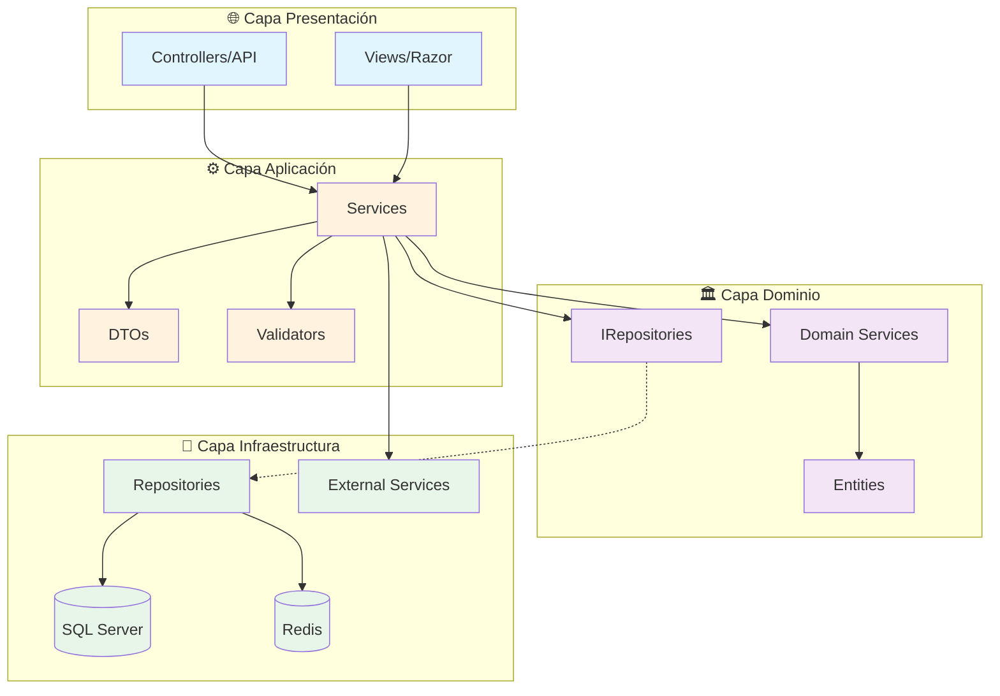

**Plantilla Mermaid - N-Capas:**
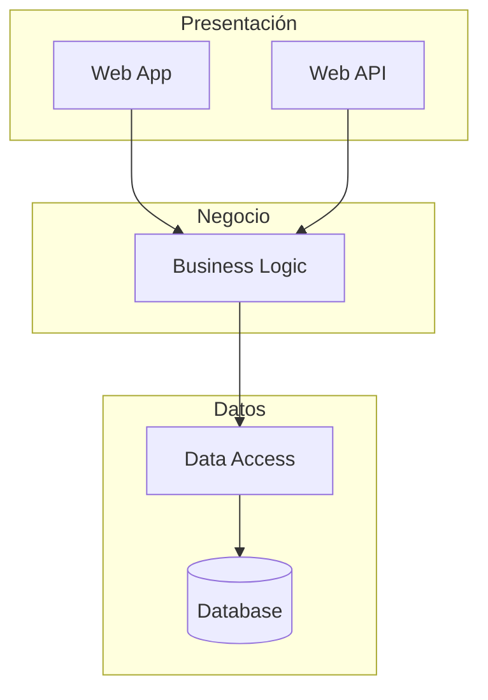

#### 11.2 DIAGRAMA DE DEPENDENCIAS ENTRE PROYECTOS

**Crear archivo:** `01_Diseno/Arquitectura/DIAGRAMA_DEPENDENCIAS.md`

```markdown
# Diagrama de Dependencias

## Referencias entre Proyectos

[Insertar diagrama Mermaid]

## Matriz de Dependencias

| Proyecto | Depende de |
|----------|------------|
| [Nombre] | [Lista] |

## Ubicación
Código fuente en: `03_Desarrollo/`
```

**Plantilla Mermaid:**
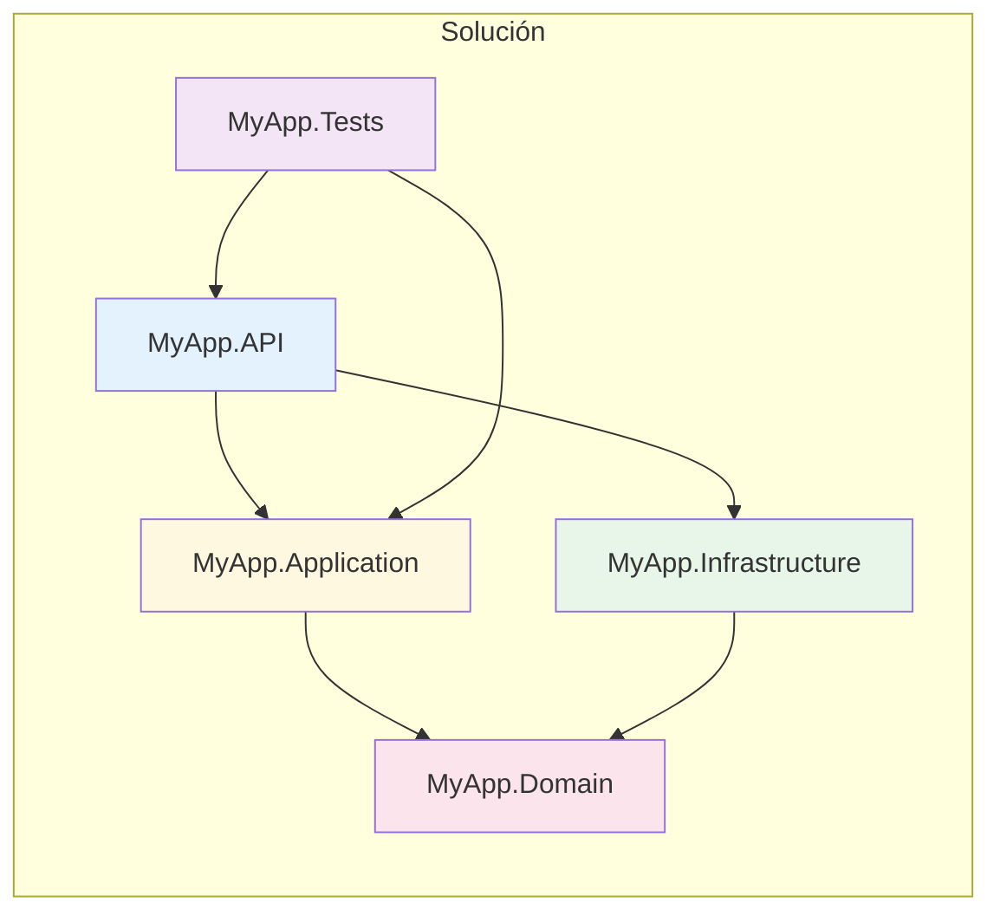

#### 11.3 DIAGRAMA DE BASE DE DATOS (si se detectan entidades)

**Crear archivo:** `01_Diseno/Arquitectura/DIAGRAMA_ENTIDADES.md`

Si se detectan clases con `[Table]` o que heredan de `DbContext` en `03_Desarrollo/`:

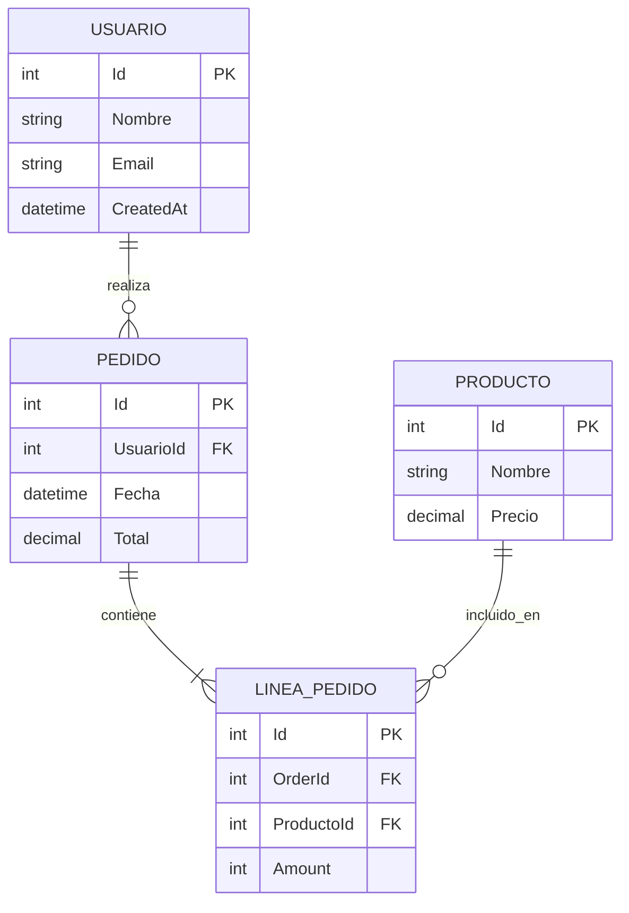

#### 11.4 DIAGRAMA DE SECUENCIAS (flujos principales)

**Crear archivo:** `01_Diseno/Arquitectura/DIAGRAMA_SECUENCIAS.md`

Analizar los Controllers en `03_Desarrollo/` e identificar los 3-5 flujos más importantes.

**Plantilla Mermaid - Autenticación:**
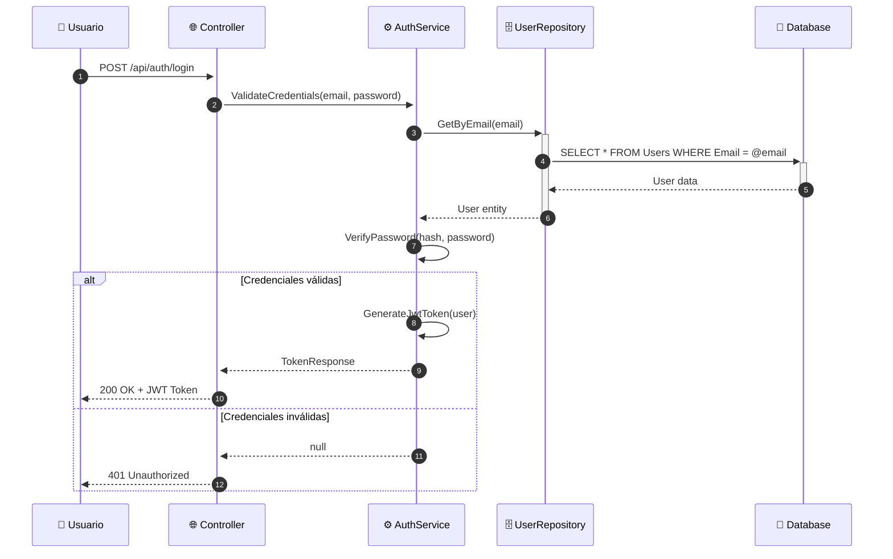

**Plantilla Mermaid - CRUD típico:**
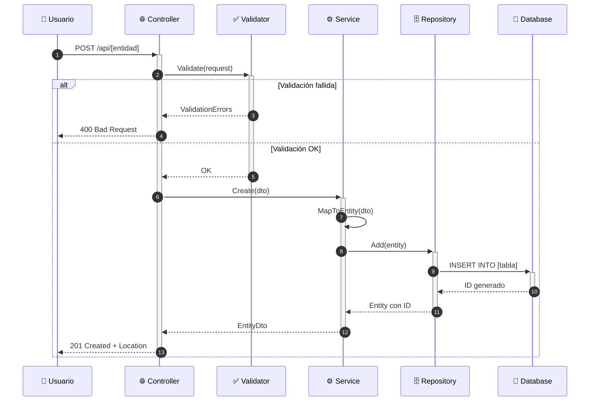

#### 11.5 DIAGRAMA DE CLASES (dominio)

**Crear archivo:** `01_Diseno/Arquitectura/DIAGRAMA_CLASES.md`

Analizar las entidades en `03_Desarrollo/**/Entities/`, `03_Desarrollo/**/Domain/`, `03_Desarrollo/**/Models/`.

**Plantilla Mermaid:**
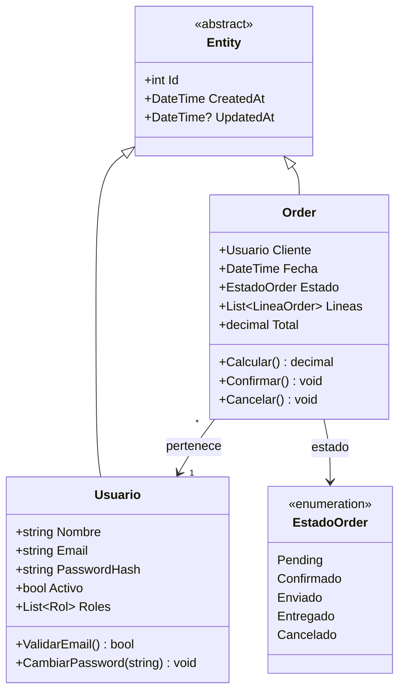

#### 11.6 DIAGRAMA DE FLUJO (procesos de negocio)

**Crear archivo:** `01_Diseno/Arquitectura/DIAGRAMA_FLUJO.md`

Identificar los procesos de negocio principales analizando los Services.

**Plantilla Mermaid - Proceso de pedido:**
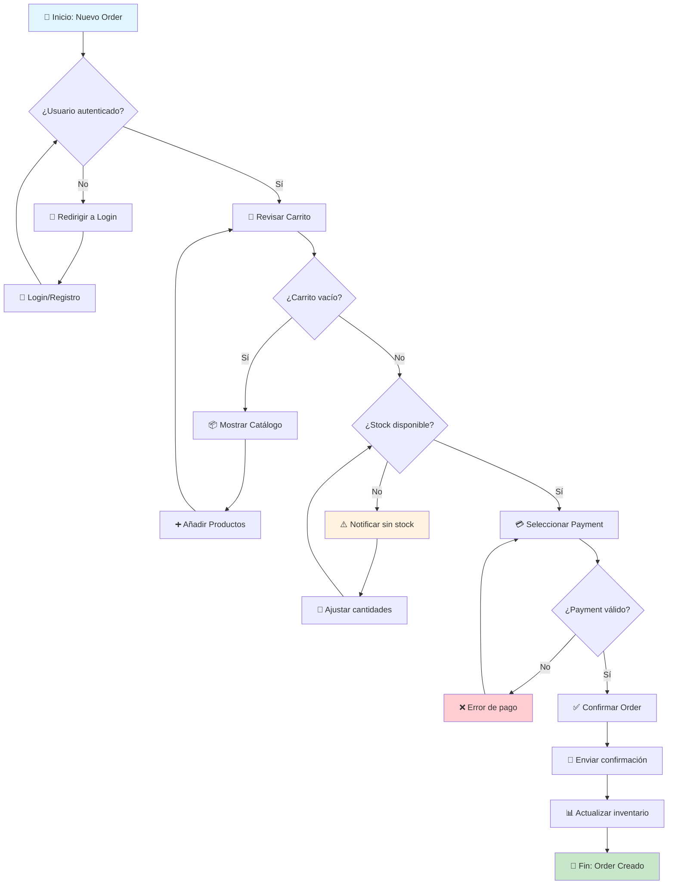

#### 11.7 DIAGRAMA DE DESPLIEGUE (infraestructura) - MEJORADO (A1)

**Crear archivo:** `01_Diseno/Arquitectura/DIAGRAMA_DESPLIEGUE.md`

Analizar `03_Desarrollo/**/appsettings*.json`, `02_Entorno/docker-compose.yml`, `05_CICD/`.

**IMPORTANTE (A1)**: Si `_hilo/ESTADO_PROYECTO.json` tiene la sección `infraestructura.entornos` configurada (no vacía), **usar datos reales** para generar el diagrama en lugar de plantillas genéricas:

```
Leer de ESTADO_PROYECTO.json → infraestructura.entornos:
  - Cada entorno (Dev, Pre, Pro) → un subgraph
  - servidor_app / servidores_app → nodos del diagrama
  - servidor_servicios → nodo separado si existe
  - balanceo: true → dibujar Load Balancer
  - url_app → label del nodo
  - cicd.plataforma → flecha de deploy
```

**Ejemplo con datos reales de la organización:**
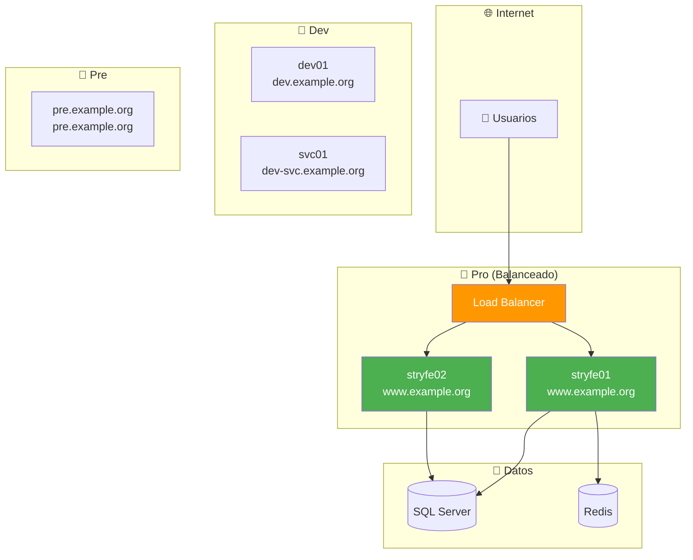

**Si `infraestructura.entornos` está vacío**, usar las plantillas genéricas:

**Plantilla Mermaid - Despliegue Azure:**
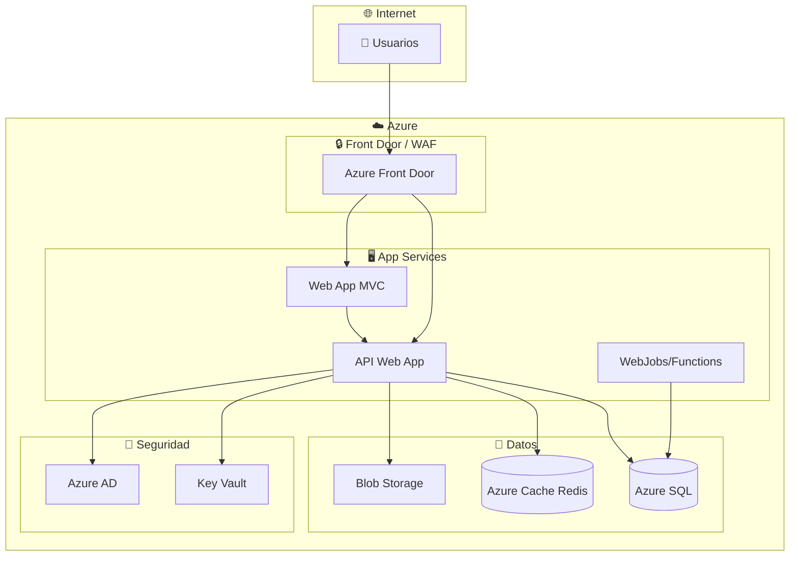

**Plantilla Mermaid - Despliegue On-Premise:**
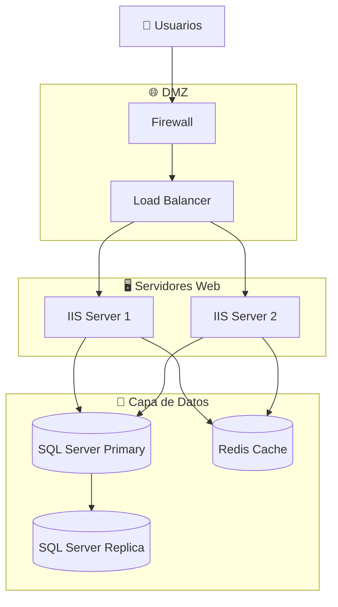

#### 11.8 DIAGRAMA DE OBSERVABILIDAD (si se detecta telemetría)

**Crear archivo:** `01_Diseno/Arquitectura/DIAGRAMA_OBSERVABILIDAD.md`

Si se detectó Serilog, OpenTelemetry o Application Insights en FASE 8:

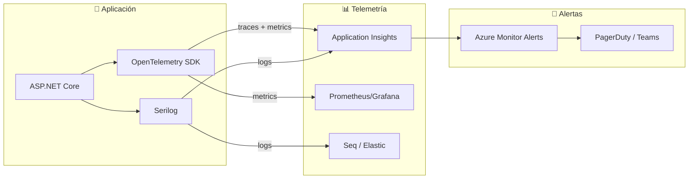

---

### FASE 12: Documentar Resultados

**Actualizar archivos:**

| Archivo | Contenido |
|---------|-----------|
| `_hilo/ESTADO_PROYECTO.json` | Métricas, fecha análisis, salud, ruta_codigo, infraestructura.cicd |
| `_hilo/DEUDA_TECNICA.md` | Issues encontrados con prioridad y estimación de esfuerzo |
| `_hilo/DEPENDENCIAS.md` | Stack tecnológico, NuGets, CVEs, CPM status |
| `_hilo/HISTORIAL_ANALISIS.json` | **NUEVO (J4)** - Registro histórico de análisis |
| `01_Diseno/Arquitectura/DIAGRAMA_COMPONENTES.md` | Diagrama de arquitectura |
| `01_Diseno/Arquitectura/DIAGRAMA_DEPENDENCIAS.md` | Referencias entre proyectos |
| `01_Diseno/Arquitectura/DIAGRAMA_ENTIDADES.md` | Modelo de datos (si aplica) |
| `01_Diseno/Arquitectura/DIAGRAMA_SECUENCIAS.md` | Flujos principales |
| `01_Diseno/Arquitectura/DIAGRAMA_CLASES.md` | Clases del dominio |
| `01_Diseno/Arquitectura/DIAGRAMA_FLUJO.md` | Procesos de negocio |
| `01_Diseno/Arquitectura/DIAGRAMA_DESPLIEGUE.md` | Infraestructura (con datos reales si disponibles) |
| `01_Diseno/Arquitectura/DIAGRAMA_OBSERVABILIDAD.md` | Telemetría (si aplica) |
| `01_Diseno/Arquitectura/INFORME_ANALISIS.md` | **Solo con `--report`**: Informe completo exportable |

### FASE 13: Historial de Análisis (J4)

**Objetivo**: Mantener registro de análisis para seguimiento de tendencias.

**Crear/Actualizar** `_hilo/HISTORIAL_ANALISIS.json`:

```json
{
  "_comentario": "Historial de análisis del proyecto. Se actualiza con /analizar.",
  "analisis": [
    {
      "fecha": "2026-03-27T10:30:00",
      "version_stic": "3.7.0",
      "usuario": "[Git user]",
      "metricas": {
        "archivos_cs": 127,
        "controllers": 8,
        "servicios": 12,
        "paquetes_nuget": 24,
        "conformidad_pct": 72,
        "cobertura_tests_pct": 65,
        "deuda_critica": 2,
        "deuda_importante": 5,
        "deuda_menor": 8,
        "deuda_total": 15,
        "secrets_expuestos": 1,
        "cves_detectados": 2,
        "salud": {
          "seguridad": "amarillo",
          "deuda": "amarillo",
          "conformidad": "verde",
          "infraestructura": "verde"
        }
      },
      "parametros": "--full",
      "diagramas_generados": 8
    }
  ]
}
```

**Al generar un nuevo análisis:**
1. Leer `_hilo/HISTORIAL_ANALISIS.json` si existe
2. Añadir nuevo registro al array `analisis`
3. Usar el registro anterior como "Antes" en la tabla comparativa
4. Guardar el archivo actualizado

---

## OUTPUT FORMAT (MANDATORY)

### Durante la ejecución - Mostrar progreso de fases:

```
═══════════════════════════════════════════════════════════════════
                      📊 ANALIZANDO PROYECTO
═══════════════════════════════════════════════════════════════════

▶ FASE 1/13: Reconocimiento General...
  ✅ Solución encontrada: 03_Desarrollo/MiProyecto.sln (o .slnx)
  ✅ Proyectos detectados: 5
  ✅ Docker: Dockerfile detectado (multi-stage)

▶ FASE 2/13: Inventario de Exclusiones...
  ✅ 45 archivos JS excluidos (librerías)
  ✅ 12 archivos CSS excluidos
  ✅ A analizar: 127 archivos propios

▶ FASE 3/13: Análisis de Seguridad 🔒...
  ⚠️ 2 issues críticos encontrados
  🔴 1 secret detectado en historial Git
  ✅ Completado

▶ FASE 4/13: Análisis Backend...
  ✅ 127 archivos .cs analizados
  ⚠️ 3 async antipatterns (.Result)
  ⚠️ 5 queries sin AsNoTracking
  ✅ Middleware pipeline: orden correcto
  ✅ Completado

▶ FASE 5/13: Análisis Frontend...
  ⏭️ SKIP - No se detectaron archivos frontend propios

▶ FASE 6/13: Evaluación de Conformidad...
  ✅ Conformidad: 72%
  ⚠️ API: Falta ProblemDetails en 3 controllers
  ✅ Completado

▶ FASE 7/13: Análisis de Dependencias...
  ✅ 24 paquetes NuGet detectados
  ✅ CPM: Directory.Packages.props detectado
  ⚠️ 2 vulnerabilidades CVE encontradas
  ✅ Completado

▶ FASE 8/13: Observabilidad y Resiliencia...
  ✅ Serilog: configurado
  ⚠️ OpenTelemetry: no detectado
  ✅ Health checks: /health + /ready
  ⚠️ Polly: no configurado
  ✅ Completado

▶ FASE 9/13: CI/CD Pipeline...
  ✅ azure-pipelines.yml detectado
  ✅ Build + Test stages
  ⚠️ Sin security scan
  ✅ Completado

▶ FASE 10/13: Tests y Cobertura...
  ✅ 3 proyectos test, 45 tests
  ✅ Cobertura: 68% global
  ✅ Completado

▶ FASE 11/13: Generando Diagramas...
  ✅ DIAGRAMA_COMPONENTES.md
  ✅ DIAGRAMA_DEPENDENCIAS.md
  ✅ DIAGRAMA_ENTIDADES.md
  ✅ DIAGRAMA_SECUENCIAS.md
  ✅ DIAGRAMA_CLASES.md
  ✅ DIAGRAMA_FLUJO.md
  ✅ DIAGRAMA_DESPLIEGUE.md (con datos reales)
  ✅ DIAGRAMA_OBSERVABILIDAD.md

▶ FASE 12/13: Documentando Resultados...
  ✅ Completado

▶ FASE 13/13: Historial de Análisis...
  ✅ HISTORIAL_ANALISIS.json actualizado (análisis #3)

═══════════════════════════════════════════════════════════════════
```

### Al finalizar - Resumen completo:

```
╔══════════════════════════════════════════════════════════════════╗
║                    ANÁLISIS COMPLETADO                            ║
╚══════════════════════════════════════════════════════════════════╝

📋 Proyecto: [NOMBRE]
📅 Fecha: [FECHA_HORA]
⏱️ Duración: [X] minutos
📁 Código: 03_Desarrollo/

┌─────────────────────────────────────────────────────────────────┐
│ 🚦 SEMÁFORO DE SALUD DEL PROYECTO (J1)                          │
├─────────────────────────────────────────────────────────────────┤
│                                                                 │
│  🔒 Seguridad:       [🟢/🟡/🔴]  [0 críticos = 🟢, 1-2 = 🟡, 3+ = 🔴] │
│  🧹 Deuda Técnica:   [🟢/🟡/🔴]  [<5 total = 🟢, 5-15 = 🟡, 15+ = 🔴] │
│  📐 Conformidad:     [🟢/🟡/🔴]  [>80% = 🟢, 50-80% = 🟡, <50% = 🔴] │
│  🏗️ Infraestructura: [🟢/🟡/🔴]  [CI/CD+Health+Obs = 🟢, parcial = 🟡, nada = 🔴] │
│  🧪 Tests:           [🟢/🟡/🔴]  [>70% cob = 🟢, 40-70% = 🟡, <40% = 🔴] │
│                                                                 │
│  SALUD GLOBAL: [🟢 SALUDABLE / 🟡 REQUIERE ATENCIÓN / 🔴 CRÍTICO] │
│                                                                 │
└─────────────────────────────────────────────────────────────────┘

┌─────────────────────────────────────────────────────────────────┐
│ 🚀 INDICADOR DE RIESGO DE DEPLOY (J2)                           │
├─────────────────────────────────────────────────────────────────┤
│                                                                 │
│  ¿Es seguro desplegar?  [🟢 SÍ / 🟡 CON PRECAUCIÓN / 🔴 NO]    │
│                                                                 │
│  Factores evaluados:                                            │
│  [✅/❌] Sin secrets expuestos en código                         │
│  [✅/❌] Sin CVEs críticos en dependencias                       │
│  [✅/❌] Tests pasan (cobertura > 60%)                           │
│  [✅/❌] Health checks configurados                              │
│  [✅/❌] Pipeline CI/CD con stages                               │
│  [✅/❌] Sin async antipatterns críticos (.Result/.Wait)          │
│                                                                 │
│  Riesgo: [X/6 factores OK]                                     │
│  6/6 = 🟢 Seguro | 4-5/6 = 🟡 Precaución | <4/6 = 🔴 No deploy │
│                                                                 │
└─────────────────────────────────────────────────────────────────┘

┌─────────────────────────────────────────────────────────────────┐
│ 📋 FASES EJECUTADAS                                             │
├─────────────────────────────────────────────────────────────────┤
│ ✅ Fase 1:  Reconocimiento       → 5 proyectos detectados       │
│ ✅ Fase 2:  Exclusiones          → 57 archivos excluidos        │
│ ✅ Fase 3:  Seguridad            → 2 críticos, 3 importantes    │
│ ✅ Fase 4:  Backend              → 127 archivos, 3 async issues │
│ ⏭️ Fase 5:  Frontend             → SKIP (no detectado)          │
│ ✅ Fase 6:  Conformidad          → 72%                          │
│ ✅ Fase 7:  Dependencias         → 24 NuGet, 2 CVEs, CPM ✅     │
│ ✅ Fase 8:  Observabilidad       → Serilog ✅, OTel ❌, Polly ❌ │
│ ✅ Fase 9:  CI/CD                → Azure Pipelines, 3 stages    │
│ ✅ Fase 10: Tests                → 68% cobertura                │
│ ✅ Fase 11: Diagramas            → 8 generados                  │
│ ✅ Fase 12: Documentación        → 12 archivos actualizados     │
│ ✅ Fase 13: Historial            → Análisis #3 registrado       │
└─────────────────────────────────────────────────────────────────┘

┌───────────────────────────────────────────────────────────────────┐
│ 📊 RESUMEN EJECUTIVO                                              │
├───────────────────────┬───────────────────────────────────────────┤
│        Métrica        │ Valor                                     │
├───────────────────────┼───────────────────────────────────────────┤
│ Proyectos             │ [N]                                       │
├───────────────────────┼───────────────────────────────────────────┤
│ Archivos .cs          │ [N]                                       │
├───────────────────────┼───────────────────────────────────────────┤
│ Controllers           │ [N]                                       │
├───────────────────────┼───────────────────────────────────────────┤
│ Servicios             │ [N]                                       │
├───────────────────────┼───────────────────────────────────────────┤
│ Repositorios          │ [N]                                       │
├───────────────────────┼───────────────────────────────────────────┤
│ Paquetes NuGet        │ [N]                                       │
├───────────────────────┼───────────────────────────────────────────┤
│ Tests                 │ [N] ([X]% cobertura)                      │
├───────────────────────┼───────────────────────────────────────────┤
│ Conformidad Plantilla │ [X]%                                      │
└───────────────────────┴───────────────────────────────────────────┘

┌───────────────────────────────────────────────────────────────────┐
│ 📈 MÉTRICAS COMPARATIVAS (vs último análisis)                     │
├─────────────────┬─────────┬─────────┬─────────────────────────────┤
│ Métrica         │ Antes   │ Después │ Cambio                      │
├─────────────────┼─────────┼─────────┼─────────────────────────────┤
│ Conformidad     │ [X]%    │ [Y]%    │ [+/-Z]% [✅/⚠️]             │
├─────────────────┼─────────┼─────────┼─────────────────────────────┤
│ Deuda crítica   │ [N]     │ [M]     │ [+/-K] [✅/⚠️]              │
├─────────────────┼─────────┼─────────┼─────────────────────────────┤
│ Deuda importante│ [N]     │ [M]     │ [+/-K] [✅/⚠️]              │
├─────────────────┼─────────┼─────────┼─────────────────────────────┤
│ Deuda menor     │ [N]     │ [M]     │ [+/-K] [✅/⚠️]              │
├─────────────────┼─────────┼─────────┼─────────────────────────────┤
│ Total deuda     │ [N]     │ [M]     │ [+/-K] [✅/⚠️]              │
├─────────────────┼─────────┼─────────┼─────────────────────────────┤
│ Secrets expuest.│ [N]     │ [M]     │ [+/-K] [✅/⚠️]              │
└─────────────────┴─────────┴─────────┴─────────────────────────────┘

Nota: Si es el primer análisis, mostrar "N/A" en columna "Antes"

┌─────────────────────────────────────────────────────────────────┐
│ 🔒 SEGURIDAD (por área)                                         │
├─────────────────────────────────────────────────────────────────┤
│ Backend:   🔴 [N]   🟠 [M]   🟡 [K]                             │
│ Frontend:  🔴 [N]   🟠 [M]   🟡 [K]                             │
│ Config:    🔴 [N]   🟠 [M]   🟡 [K]                             │
│ ─────────────────────────────────────                           │
│ Total:     🔴 [X]   🟠 [Y]   🟡 [Z]                             │
│                                                                 │
│ Vulnerabilidades CVE:                                           │
│   🔴 Newtonsoft.Json < 13.0.1 - CVE-2024-XXXX                   │
│   🟠 System.Text.Json < 6.0.0 - CVE-2023-XXXX                   │
└─────────────────────────────────────────────────────────────────┘

┌─────────────────────────────────────────────────────────────────┐
│ 🧹 DEUDA TÉCNICA (por área)                                     │
├─────────────────────────────────────────────────────────────────┤
│ Backend:   🔴 [N]   🟠 [M]   🟡 [K]                             │
│ Frontend:  🔴 [N]   🟠 [M]   🟡 [K]                             │
│ ─────────────────────────────────────                           │
│ Total:     🔴 [X]   🟠 [Y]   🟡 [Z]                             │
└─────────────────────────────────────────────────────────────────┘

┌─────────────────────────────────────────────────────────────────┐
│ ⏱️ ESTIMACIÓN DE DEUDA TOTAL (J5)                                │
├─────────────────────────────────────────────────────────────────┤
│                                                                 │
│ Deuda técnica estimada:                                         │
│   🔴 Crítica:     [N] issues × ~[X]h = [Y] horas               │
│   🟠 Importante:  [N] issues × ~[X]h = [Y] horas               │
│   🟡 Menor:       [N] issues × ~[X]h = [Y] horas               │
│   ─────────────────────────────────────                         │
│   TOTAL:          [N] issues = ~[X] horas ([Y] sprints*)       │
│                                                                 │
│   * Sprint de 2 semanas, 6h/día efectivas                      │
│                                                                 │
│ Distribución por área:                                          │
│   Seguridad:      ~[X]h  ████████░░ [Y]%                       │
│   Código:         ~[X]h  ██████░░░░ [Y]%                       │
│   Infraestructura:~[X]h  ████░░░░░░ [Y]%                       │
│   Tests:          ~[X]h  ██░░░░░░░░ [Y]%                       │
│                                                                 │
└─────────────────────────────────────────────────────────────────┘

┌─────────────────────────────────────────────────────────────────┐
│ 📦 CÓDIGO ANALIZADO vs EXCLUIDO                                 │
├─────────────────────────────────────────────────────────────────┤
│ ✅ Analizado:                                                   │
│    • [N] archivos .cs (backend)                                 │
│    • [M] archivos .js propios                                   │
│    • [K] archivos .css propios                                  │
│    • [X] vistas .cshtml                                         │
│                                                                 │
│ ⏭️ Excluido (librerías externas):                               │
│    • [Y] archivos JavaScript                                    │
│    • [Z] archivos CSS                                           │
│    • [W] carpetas de vendors                                    │
└─────────────────────────────────────────────────────────────────┘

┌─────────────────────────────────────────────────────────────────┐
│ 📚 STACK TECNOLÓGICO                                            │
├─────────────────────────────────────────────────────────────────┤
│ Framework:      .NET [X.X]                                      │
│ Tipo:           [WebAPI | MVC | Blazor | Console]               │
│ Acceso datos:   [Dapper | EF Core | ADO.NET]                    │
│ Base datos:     [SQL Server | Oracle | PostgreSQL]              │
│ Auth:           [Azure AD | JWT | Identity]                     │
│ Cache:          [Redis | MemoryCache | None]                    │
│ Logging:        [Serilog | NLog | Default]                      │
│ Observabilidad: [OpenTelemetry | AppInsights | Ninguna]         │
│ Resiliencia:    [Polly v8+ | Polly v7 | Ninguna]               │
│ CI/CD:          [Azure Pipelines | GitHub Actions | Manual]     │
│ Paquetes:       [CPM | Individual] ([N] NuGet)                  │
│ Docker:         [✅ Multi-stage | ✅ Básico | ❌ Sin Docker]     │
└─────────────────────────────────────────────────────────────────┘

┌─────────────────────────────────────────────────────────────────┐
│ 📊 OBSERVABILIDAD Y RESILIENCIA                                 │
├─────────────────────────────────────────────────────────────────┤
│                                                                 │
│ Observabilidad:                                                 │
│   Logging:     [✅ Serilog / ⚠️ ILogger / ❌ Console]           │
│   Telemetría:  [✅ OTel+AI / ⚠️ Solo AI / ❌ Ninguna]          │
│   Health:      [✅ 3 endpoints / ⚠️ Solo /health / ❌ Ninguno] │
│   Nivel:       [🟢 Avanzado / 🟡 Básico / 🔴 Insuficiente]    │
│                                                                 │
│ Resiliencia:                                                    │
│   Polly:       [✅ v8+ / ⚠️ v7 / ❌ Sin políticas]             │
│   Retry:       [✅ / ❌]                                        │
│   Circuit:     [✅ / ❌]                                        │
│   Shutdown:    [✅ Graceful / ❌ Sin graceful]                   │
│   Nivel:       [🟢 Robusto / 🟡 Básico / 🔴 Frágil]           │
│                                                                 │
└─────────────────────────────────────────────────────────────────┘

┌─────────────────────────────────────────────────────────────────┐
│ 📐 DIAGRAMAS GENERADOS (8+)                                     │
├─────────────────────────────────────────────────────────────────┤
│                                                                 │
│ ✅ DIAGRAMA_COMPONENTES.md      - Arquitectura del sistema      │
│ ✅ DIAGRAMA_DEPENDENCIAS.md     - Referencias entre proyectos   │
│ ✅ DIAGRAMA_ENTIDADES.md        - Modelo de datos (si aplica)   │
│ ✅ DIAGRAMA_SECUENCIAS.md       - Flujos principales            │
│ ✅ DIAGRAMA_CLASES.md           - Clases del dominio            │
│ ✅ DIAGRAMA_FLUJO.md            - Procesos de negocio           │
│ ✅ DIAGRAMA_DESPLIEGUE.md       - Infraestructura (datos reales)│
│ ✅ DIAGRAMA_OBSERVABILIDAD.md   - Telemetría (si aplica)        │
│                                                                 │
│    → Todos en 01_Diseno/Arquitectura/                           │
│                                                                 │
└─────────────────────────────────────────────────────────────────┘
```

### TOP 5 Acciones Prioritarias (J6 - ajustado por criticidad del proyecto):

> **NOTA (J6)**: Si `_hilo/ESTADO_PROYECTO.json` → `criticidad.nivel` está configurado:
> - **Alta**: Priorizar seguridad y estabilidad sobre deuda técnica
> - **Media**: Balance entre seguridad y mejoras
> - **Baja**: Puede priorizar mejoras de calidad y refactoring

```
🎯 TOP 5 ACCIONES PRIORITARIAS
━━━━━━━━━━━━━━━━━━━━━━━━━━━━━━━━━━━━━━━━━━━━━━━━━━━━━━━━━━━━━━━━━
[Criticidad proyecto: ALTA → Foco en seguridad y estabilidad]

1. 🔴 [CRÍTICO] Rotar password certificado BD
   📁 03_Desarrollo/appsettings.json
   💡 Mover a Azure Key Vault o User Secrets
   ⏱️ Esfuerzo: ~2h

2. 🔴 [CRÍTICO] Eliminar .Result (deadlock potencial)
   📁 03_Desarrollo/Services/UserService.cs:45,78
   💡 Cambiar a await, propagar async
   ⏱️ Esfuerzo: ~3h

3. 🔴 [CRÍTICO] Refactorizar God Class
   📁 03_Desarrollo/Services/UserService.cs (650 líneas)
   💡 Dividir en UserAuthService, UserProfileService
   ⏱️ Esfuerzo: ~4h

4. 🟠 [IMPORTANTE] Actualizar Newtonsoft.Json vulnerable
   📁 03_Desarrollo/MyApp.API/MyApp.API.csproj
   💡 Actualizar a versión >= 13.0.1 (CVE-2024-XXXX)
   ⏱️ Esfuerzo: ~1h

5. 🟠 [IMPORTANTE] Configurar OpenTelemetry
   📁 03_Desarrollo/Program.cs
   💡 Añadir AddOpenTelemetry + exporters (ver /add-telemetry)
   ⏱️ Esfuerzo: ~3h
```

### Archivos Actualizados:

```
📁 ARCHIVOS ACTUALIZADOS:
   ✅ _hilo/ESTADO_PROYECTO.json
   ✅ _hilo/DEUDA_TECNICA.md
   ✅ _hilo/DEPENDENCIAS.md
   ✅ _hilo/HISTORIAL_ANALISIS.json    ← NUEVO (historial)

📁 DIAGRAMAS GENERADOS:
   ✅ 01_Diseno/Arquitectura/DIAGRAMA_COMPONENTES.md
   ✅ 01_Diseno/Arquitectura/DIAGRAMA_DEPENDENCIAS.md
   ✅ 01_Diseno/Arquitectura/DIAGRAMA_ENTIDADES.md
   ✅ 01_Diseno/Arquitectura/DIAGRAMA_SECUENCIAS.md
   ✅ 01_Diseno/Arquitectura/DIAGRAMA_CLASES.md
   ✅ 01_Diseno/Arquitectura/DIAGRAMA_FLUJO.md
   ✅ 01_Diseno/Arquitectura/DIAGRAMA_DESPLIEGUE.md
   ✅ 01_Diseno/Arquitectura/DIAGRAMA_OBSERVABILIDAD.md  ← NUEVO
   [Si --report] 01_Diseno/Arquitectura/INFORME_ANALISIS.md
```

### Próximos Pasos:

```
💡 PRÓXIMOS PASOS SUGERIDOS:

1. 🔴 Resolver issues CRÍTICOS (esta semana)
   • Revisar _hilo/DEUDA_TECNICA.md

2. 🔄 Planificar 🟠 IMPORTANTES en próximo sprint
   • /nuevo-evolutivo "Resolver deuda técnica Q1"

3. 📊 Ver dashboard actualizado
   • /estado

4. ✅ Si todo OK, hacer commit
   • /commit "Análisis completado - X issues identificados"
```

---

## ⚠️ FASE FINAL OBLIGATORIA: Actualizar Visual Studio ⚠️

**CLAUDE CODE: EJECUTAR SIEMPRE AL TERMINAR**

Después de generar los diagramas, **DEBES** ejecutar este comando para añadirlos a la solución:

```powershell
# EJECUTAR ESTO OBLIGATORIAMENTE
./.claude/commands/integracion-vs.ps1
```

**Si no ejecutas este comando:**
- ❌ Los diagramas NO aparecerán en Visual Studio
- ❌ El usuario no verá los archivos generados
- ❌ El análisis estará INCOMPLETO

**Output esperado:**
```
┌─────────────────────────────────────────────────────────────────┐
│ INTEGRACIÓN VISUAL STUDIO                                       │
├─────────────────────────────────────────────────────────────────┤
│ [OK] Contexto Claude      (7 archivos)                          │
│ [OK] Especificaciones     (1 archivos)                          │
│ [OK] Diagramas            (7 archivos)  ← Los nuevos diagramas  │
│ [OK] Gestion              (3 archivos)                          │
│ ...                                                             │
└─────────────────────────────────────────────────────────────────┘
✅ 8 Solution Folders añadidos/actualizados
```

---

## ⚠️ --report: Informe Exportable (J7) ⚠️

Si se usa el parámetro `--report`, generar adicionalmente:

**Crear archivo:** `01_Diseno/Arquitectura/INFORME_ANALISIS.md`

```markdown
# Informe de Análisis - [NOMBRE_PROYECTO]

**Fecha**: [YYYY-MM-DD HH:MM]
**Versión Ovillo**: 3.7.0
**Analizado por**: Claude Code
**Parámetros**: [--full/--quick/--security/etc.]

## Semáforo de Salud

| Área | Estado | Detalle |
|------|--------|---------|
| Seguridad | [🟢/🟡/🔴] | [N] críticos, [M] importantes |
| Deuda | [🟢/🟡/🔴] | [N] issues, ~[X]h estimadas |
| Conformidad | [🟢/🟡/🔴] | [X]% |
| Infraestructura | [🟢/🟡/🔴] | CI: [sí/no], Health: [sí/no] |
| Tests | [🟢/🟡/🔴] | [X]% cobertura |

## Riesgo de Deploy: [🟢/🟡/🔴]

[Tabla de factores evaluados]

## Stack Tecnológico

[Tabla completa incluyendo Obs/Resiliencia/CI/Docker]

## Issues Encontrados

### Críticos (🔴)
[Lista detallada con archivo, línea, esfuerzo]

### Importantes (🟠)
[Lista detallada con archivo, línea, esfuerzo]

### Menores (🟡)
[Lista detallada con archivo, línea, esfuerzo]

## Estimación de Deuda Total
[Tabla por área con horas y porcentaje]

## Diagramas Generados
[Enlaces relativos a los 8+ diagramas]

## Tendencia (últimos análisis)
[Tabla extraída de HISTORIAL_ANALISIS.json]

## TOP 5 Acciones Recomendadas
[Con prioridad, esfuerzo y justificación]

---
*Informe generado por Ovillo v3.7.0 - /analizar --report*
```

---

## ⚠️ CRITICAL REMINDERS - MUST FOLLOW ⚠️

### 1. MANDATORY EMOJIS 🔴 🟠 🟡

**SIEMPRE** usar estos emojis de colores en el output:
- 🔴 = Crítico (copiar: 🔴)
- 🟠 = Importante (copiar: 🟠)  
- 🟡 = Menor (copiar: 🟡)

**EJEMPLO OBLIGATORIO:**
```
🔴 CRÍTICO (3):
   • SEC-001: Password hardcodeado en appsettings.json
   
🟠 IMPORTANTE (4):
   • CODE-001: God Class en UserService.cs (650 LOC)
   
🟡 MENOR (2):
   • CODE-005: Console.WriteLine en producción
```

### 2. MANDATORY TOP 5 ACCIONES PRIORITARIAS

**SIEMPRE** incluir esta sección al final con formato exacto:

```
🎯 TOP 5 ACCIONES PRIORITARIAS
━━━━━━━━━━━━━━━━━━━━━━━━━━━━━━━━━━━━━━━━━━━━━━━━━━━━━━━━━━━━━━━━━

1. 🔴 [CRÍTICO] [Título del issue]
   📁 [Ruta del archivo]
   💡 [Recomendación de solución]
   Esfuerzo: [X] horas
   
2. 🔴 [CRÍTICO] [Título del issue]
   📁 [Ruta del archivo]
   💡 [Recomendación de solución]
   Esfuerzo: [X] horas

3. 🟠 [IMPORTANTE] [Título del issue]
   📁 [Ruta del archivo]
   💡 [Recomendación de solución]
   Esfuerzo: [X] horas

4. 🟠 [IMPORTANTE] [Título del issue]
   📁 [Ruta del archivo]
   💡 [Recomendación de solución]
   Esfuerzo: [X] horas

5. 🟠 [IMPORTANTE] [Título del issue]
   📁 [Ruta del archivo]
   💡 [Recomendación de solución]
   Esfuerzo: [X] horas
```

### 3. MANDATORY VISUAL BOXES

**SIEMPRE** usar cajas visuales con estos caracteres:
```
┌─────────────────────────────────────────────────────────────────┐
│ TÍTULO DE LA SECCIÓN                                            │
├─────────────────────────────────────────────────────────────────┤
│ Contenido aquí                                                  │
└─────────────────────────────────────────────────────────────────┘
```

### 4. MANDATORY SECTIONS IN OUTPUT

El output DEBE incluir TODAS estas secciones:

| Sección | Obligatorio | Emoji/Formato |
|---------|-------------|---------------|
| **🚦 SEMÁFORO DE SALUD** | ✅ | 🟢/🟡/🔴 por área + global |
| **🚀 RIESGO DE DEPLOY** | ✅ | 🟢/🟡/🔴 con factores |
| Fases ejecutadas | ✅ | ▶ FASE X/13 |
| **📊 RESUMEN EJECUTIVO** | ✅ | Tabla con Proyectos, Archivos, Controllers, etc. |
| **📈 MÉTRICAS COMPARATIVAS** | ✅ | Tabla ANTES/DESPUÉS (de HISTORIAL_ANALISIS.json, N/A si primer análisis) |
| Seguridad (por área) | ✅ | 🔴 🟠 🟡 Backend/Frontend/Config/Git |
| Deuda técnica (por área) | ✅ | 🔴 🟠 🟡 Backend/Frontend |
| **⏱️ ESTIMACIÓN DEUDA** | ✅ | Horas + sprints por área |
| Código analizado vs excluido | ✅ | Caja visual |
| Stack tecnológico | ✅ | Caja visual (incluye Obs/Resiliencia/CI/Docker) |
| **📊 OBSERVABILIDAD Y RESILIENCIA** | ✅ | Niveles por componente |
| Diagramas generados (8+) | ✅ | ✅ lista |
| **🎯 TOP 5 ACCIONES** | ✅ | Con 🔴🟠, 📁, 💡, ⏱️ Esfuerzo, ajustado por criticidad |
| Archivos actualizados | ✅ | ✅ lista |
| Próximos pasos | ✅ | 💡 lista |

### 5. PHASE PROGRESS FORMAT

```
▶ FASE 1/13: Reconocimiento General...
  ✅ Solución encontrada: 03_Desarrollo/MiProyecto.sln

▶ FASE 5/13: Análisis Frontend...
  ⏭️ SKIP - No se detectaron archivos frontend propios
```

### 6. GENERATE 8+ MERMAID DIAGRAMS

Unless `--quick`, **ALWAYS** generate:

| # | Diagram | Required |
|---|---------|----------|
| 1 | DIAGRAMA_COMPONENTES.md | ✅ Always |
| 2 | DIAGRAMA_DEPENDENCIAS.md | ✅ Always |
| 3 | DIAGRAMA_ENTIDADES.md | If entities |
| 4 | DIAGRAMA_SECUENCIAS.md | ✅ Always |
| 5 | DIAGRAMA_CLASES.md | ✅ Always |
| 6 | DIAGRAMA_FLUJO.md | ✅ Always |
| 7 | DIAGRAMA_DESPLIEGUE.md | ✅ Always (con datos reales si disponibles) |
| 8 | DIAGRAMA_OBSERVABILIDAD.md | If telemetry detected |

### 7. SEARCH LOCATION

- Code: `03_Desarrollo/`
- Diagrams: `01_Diseno/Arquitectura/`

### 8. ⚠️ MANDATORY: EJECUTAR integracion-vs.ps1 AL FINAL ⚠️

**SIEMPRE** ejecutar este comando al terminar el análisis:

```powershell
./.claude/commands/integracion-vs.ps1
```

**Sin este paso:**
- ❌ Los diagramas NO aparecen en Visual Studio
- ❌ El análisis está INCOMPLETO

**Verificar output:**
```
✅ 8 Solution Folders añadidos/actualizados
```

### 9. MANDATORY: HISTORIAL DE ANÁLISIS (J4)

**SIEMPRE** crear/actualizar `_hilo/HISTORIAL_ANALISIS.json` al finalizar.
- Leer archivo existente si hay
- Añadir nuevo registro con métricas del análisis actual
- Usar registro anterior como "Antes" en métricas comparativas

### 10. MANDATORY: SEMÁFORO + DEPLOY RISK (J1, J2)

**SIEMPRE** incluir SEMÁFORO DE SALUD y RIESGO DE DEPLOY como las DOS PRIMERAS secciones después del header.
- Semáforo: Evaluar 5 áreas (Seguridad, Deuda, Conformidad, Infraestructura, Tests)
- Deploy Risk: Evaluar 6 factores binarios → calcular score

### 11. CRITICIDAD DEL PROYECTO (J6)

Si `_hilo/ESTADO_PROYECTO.json` → `criticidad.nivel` está configurado, **AJUSTAR PRIORIZACIÓN**:
- **Alta**: Seguridad > Estabilidad > Deuda > Mejoras
- **Media**: Balance entre todas las áreas
- **Baja**: Puede priorizar mejoras de calidad y refactoring

Mostrar `[Criticidad proyecto: ALTA/MEDIA/BAJA → Foco en ...]` antes del TOP 5.

### 12. PARAMETER-SPECIFIC BEHAVIOR

| Parámetro | Fases que ejecuta |
|-----------|-------------------|
| `--quick` | 1, 2, 7, 13. Sin diagramas. |
| `--full` | Todas (1-13). Default. |
| `--security` | 1, 3. Solo seguridad + secrets en git. |
| `--backend` | 1, 2, 3, 4, 6, 7. Sin frontend. |
| `--frontend` | 1, 2, 5. Solo frontend. |
| `--infra` | 1, 8, 9, 10, 11.7. Solo infra + observabilidad + CI/CD + despliegue. |
| `--report` | Igual que `--full` + genera INFORME_ANALISIS.md exportable. |
| `--compare` | Igual que `--full` + tabla comparativa forzada (requiere historial). |

---

## EXAMPLE OF CORRECT OUTPUT (follow this format exactly)

```
╔══════════════════════════════════════════════════════════════════╗
║                    ANÁLISIS COMPLETADO                            ║
╚══════════════════════════════════════════════════════════════════╝

📋 Proyecto: MyCompany.Exp
📅 Fecha: 2026-03-27
📁 Código: 03_Desarrollo/

┌─────────────────────────────────────────────────────────────────┐
│ 🚦 SEMÁFORO DE SALUD DEL PROYECTO                               │
├─────────────────────────────────────────────────────────────────┤
│  🔒 Seguridad:       🟡  (2 críticos)                           │
│  🧹 Deuda Técnica:   🟡  (12 issues)                            │
│  📐 Conformidad:     🟢  (85%)                                  │
│  🏗️ Infraestructura: 🟡  (CI ✅, Health ⚠️, OTel ❌)            │
│  🧪 Tests:           🟢  (72% cobertura)                        │
│                                                                 │
│  SALUD GLOBAL: 🟡 REQUIERE ATENCIÓN                             │
└─────────────────────────────────────────────────────────────────┘

┌─────────────────────────────────────────────────────────────────┐
│ 🚀 INDICADOR DE RIESGO DE DEPLOY                                │
├─────────────────────────────────────────────────────────────────┤
│  ¿Es seguro desplegar?  🟡 CON PRECAUCIÓN                      │
│                                                                 │
│  ✅ Sin secrets en código actual                                 │
│  ❌ 1 CVE crítico en dependencias                               │
│  ✅ Tests pasan (72% cobertura)                                  │
│  ⚠️ Health checks parciales (solo /health)                      │
│  ✅ Pipeline CI/CD con 3 stages                                  │
│  ✅ Sin async antipatterns críticos                              │
│                                                                 │
│  Riesgo: 4/6 factores OK → 🟡 Precaución                       │
└─────────────────────────────────────────────────────────────────┘

┌───────────────────────────────────────────────────────────────────┐
│ 📊 RESUMEN EJECUTIVO                                              │
├───────────────────────┬───────────────────────────────────────────┤
│        Métrica        │ Valor                                     │
├───────────────────────┼───────────────────────────────────────────┤
│ Proyectos             │ 12                                        │
├───────────────────────┼───────────────────────────────────────────┤
│ Archivos .cs          │ 336                                       │
├───────────────────────┼───────────────────────────────────────────┤
│ Controllers           │ 20                                        │
├───────────────────────┼───────────────────────────────────────────┤
│ Servicios             │ 18                                        │
├───────────────────────┼───────────────────────────────────────────┤
│ Paquetes NuGet        │ 15 (CPM: ✅)                              │
├───────────────────────┼───────────────────────────────────────────┤
│ Tests / Cobertura     │ 45 tests / 72%                            │
├───────────────────────┼───────────────────────────────────────────┤
│ Conformidad Plantilla │ 85%                                       │
├───────────────────────┼───────────────────────────────────────────┤
│ Deuda total           │ 12 issues (~28h / ~0.5 sprints)           │
└───────────────────────┴───────────────────────────────────────────┘

┌───────────────────────────────────────────────────────────────────┐
│ 📈 MÉTRICAS COMPARATIVAS (vs análisis #2, 2026-03-15)             │
├─────────────────┬─────────┬─────────┬─────────────────────────────┤
│ Métrica         │ Antes   │ Después │ Cambio                      │
├─────────────────┼─────────┼─────────┼─────────────────────────────┤
│ Conformidad     │ 73%     │ 85%     │ +12% ✅                     │
├─────────────────┼─────────┼─────────┼─────────────────────────────┤
│ Deuda crítica   │ 5       │ 2       │ -3 ✅                       │
├─────────────────┼─────────┼─────────┼─────────────────────────────┤
│ Deuda total     │ 16      │ 12      │ -4 ✅                       │
├─────────────────┼─────────┼─────────┼─────────────────────────────┤
│ Cobertura       │ 55%     │ 72%     │ +17% ✅                     │
├─────────────────┼─────────┼─────────┼─────────────────────────────┤
│ Secrets expuest.│ 1       │ 0       │ -1 ✅                       │
└─────────────────┴─────────┴─────────┴─────────────────────────────┘

┌─────────────────────────────────────────────────────────────────┐
│ 🔒 SEGURIDAD                                                    │
├─────────────────────────────────────────────────────────────────┤
│ Backend:   🔴 1   🟠 3   🟡 5                                   │
│ Frontend:  🔴 0   🟠 1   🟡 2                                   │
│ Config:    🔴 1   🟠 0   🟡 1                                   │
│ Git hist:  🔴 0   🟠 0   🟡 0                                   │
│ ─────────────────────────────────────                           │
│ Total:     🔴 2   🟠 4   🟡 8                                   │
└─────────────────────────────────────────────────────────────────┘

┌─────────────────────────────────────────────────────────────────┐
│ ⏱️ ESTIMACIÓN DE DEUDA TOTAL                                     │
├─────────────────────────────────────────────────────────────────┤
│ 🔴 Crítica:     2 issues × ~3h = 6 horas                       │
│ 🟠 Importante:  4 issues × ~3h = 12 horas                      │
│ 🟡 Menor:       6 issues × ~1.5h = 9 horas                     │
│ ─────────────────────────────────────                           │
│ TOTAL:          12 issues = ~27 horas (~0.5 sprints)            │
│                                                                 │
│ Seguridad:      ~8h  ████████░░ 30%                             │
│ Código:         ~10h ██████████ 37%                             │
│ Infraestructura:~6h  ██████░░░░ 22%                             │
│ Tests:          ~3h  ███░░░░░░░ 11%                             │
└─────────────────────────────────────────────────────────────────┘

🎯 TOP 5 ACCIONES PRIORITARIAS
━━━━━━━━━━━━━━━━━━━━━━━━━━━━━━━━━━━━━━━━━━━━━━━━━━━━━━━━━━━━━━━━━
[Criticidad proyecto: MEDIA → Balance seguridad/mejoras]

1. 🔴 [CRÍTICO] Eliminar credenciales hardcodeadas
   📁 03_Desarrollo/appsettings.json:12
   💡 Migrar a Azure Key Vault o User Secrets
   ⏱️ Esfuerzo: ~2h

2. 🔴 [CRÍTICO] Actualizar paquete con CVE crítico
   📁 03_Desarrollo/*.csproj
   💡 Actualizar Newtonsoft.Json >= 13.0.1
   ⏱️ Esfuerzo: ~1h

3. 🟠 [IMPORTANTE] Configurar OpenTelemetry
   📁 03_Desarrollo/Program.cs
   💡 Usar /add-telemetry para setup completo
   ⏱️ Esfuerzo: ~3h

4. 🟠 [IMPORTANTE] Añadir health checks /ready y /live
   📁 03_Desarrollo/Program.cs
   💡 Usar /health-check para configuración guiada
   ⏱️ Esfuerzo: ~2h

5. 🟠 [IMPORTANTE] Configurar Polly retry + circuit breaker
   📁 03_Desarrollo/Program.cs
   💡 Usar /add-resilience para HttpClient policies
   ⏱️ Esfuerzo: ~2h
```
