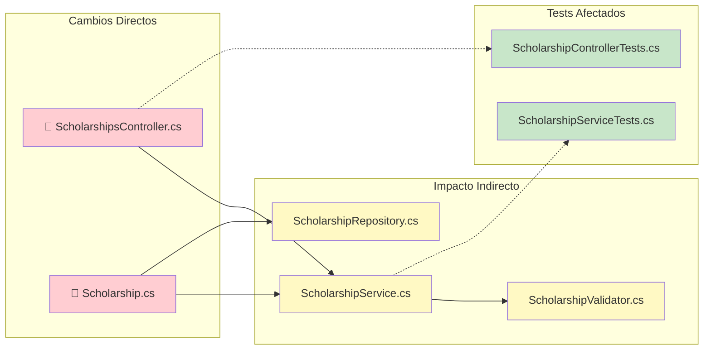

Analiza el impacto de cambios antes de modificar código crítico

# Comando: /revision

> Analiza el impacto de cambios antes de modificar código crítico

## 🧠 Extended Thinking Mode

**think harder - Analiza profundamente el impacto de cada cambio.**

---

## IMPORTANTE: Estructura de Carpetas

El código fuente está en `03_Desarrollo/`. El análisis de impacto debe considerar esta estructura.

```
MiProyecto/                     ← Raíz del repo (aquí está .git)
├── _hilo/                     ← Contexto del proyecto
├── 01_Diseno/                  ← Diagramas
├── 03_Desarrollo/              ← CÓDIGO FUENTE ⭐
│   ├── MiSolucion.sln|.slnx    ← .slnx solo .NET 8+
│   ├── MiProyecto.API/
│   ├── MiProyecto.Domain/
│   └── ...
├── 04_Pruebas/                 ← Tests adicionales
└── 06_Documentacion/           ← Documentación
```

---

## Análisis de Cambios

### 1. Identificar Archivos Modificados

```bash
# Git está en la raíz, mostrará cambios en 03_Desarrollo/
git diff --name-only
git diff --staged --name-only

# Filtrar solo cambios en código
git diff --name-only | grep "03_Desarrollo/"
```

### 2. Clasificar por Área (dentro de 03_Desarrollo/)

| Área | Ruta Típica | Impacto |
|------|-------------|---------|
| Controllers / API | `03_Desarrollo/*/Controllers/` | Alto |
| Services / Application | `03_Desarrollo/*/Services/` | Alto |
| Domain / Entities | `03_Desarrollo/*/Domain/` | Muy Alto |
| Infrastructure / Repositories | `03_Desarrollo/*/Infrastructure/` | Alto |
| Tests | `03_Desarrollo/*.Tests/` | Medio |
| Configuración | `03_Desarrollo/*/appsettings*.json` | Alto |

---

## Análisis de Dependencias

### 1. Leer Mapa de Dependencias
Consultar `_hilo/DEPENDENCIAS.md`:
- Identificar componentes afectados
- Buscar integraciones relacionadas
- Verificar stored procedures dependientes

### 2. Analizar Referencias entre Proyectos

```powershell
# Leer ProjectReference de cada .csproj en 03_Desarrollo/
Get-ChildItem -Path "03_Desarrollo" -Filter "*.csproj" -Recurse | ForEach-Object {
    Write-Host "Proyecto: $($_.Name)"
    Select-String -Path $_.FullName -Pattern "ProjectReference"
}
```

### 3. Cruzar con Funcionalidades
Consultar `_hilo/FUNCIONALIDADES.md`:
- Identificar funcionalidades afectadas
- Verificar reglas de negocio
- Buscar dependientes

---

## Generación de Informe

```markdown
## Informe de Impacto

### Archivos Modificados (en 03_Desarrollo/)
- `03_Desarrollo/MiProyecto.API/Controllers/ScholarshipsController.cs`
- `03_Desarrollo/MiProyecto.Domain/Entities/Scholarship.cs`
- [lista de archivos]

### Componentes Afectados Directamente
- [lista]

### Posible Impacto en:
- [componentes dependientes]
- [integraciones]
- [procesos batch]

### Tests a Ejecutar (en 03_Desarrollo/)
- [ ] Tests unitarios: `03_Desarrollo/MiProyecto.Tests/`
- [ ] Tests de integración: `03_Desarrollo/MiProyecto.IntegrationTests/`
- [ ] Tests E2E de [flujos]

### Riesgos Identificados
| Riesgo | Probabilidad | Impacto | Mitigación |
|--------|--------------|---------|------------|
| [riesgo] | [alta/media/baja] | [descripción] | [acción] |

### Recomendaciones
1. [recomendación 1]
2. [recomendación 2]
```

---

## Preguntas al Desarrollador

1. "He identificado impacto en {0}. ¿Quieres que profundice?"
2. "¿Conoces dependencias adicionales no documentadas?"
3. "¿Ejecuto los tests de las áreas afectadas? (`/test`)"
4. "¿Hay alguien que deba revisar estos cambios?"

---

## Acciones Sugeridas

### Si el impacto es ALTO:
- Recomendar revisar con responsable técnico
- Sugerir crear rama de feature
- Proponer tests adicionales
- Ejecutar `/analizar --security` antes de commit

### Si el impacto es MEDIO:
- Sugerir ejecutar tests de integración
- Recomendar documentar cambios en `_hilo/DECISIONES.md`

### Si el impacto es BAJO:
- Proceder con precaución normal
- Ejecutar tests unitarios (`/test`)

---

## Diagrama de Dependencias Afectadas

Si hay múltiples componentes afectados, generar diagrama:



Guardar en `01_Diseno/Arquitectura/IMPACTO_CAMBIOS.md` si es significativo.
