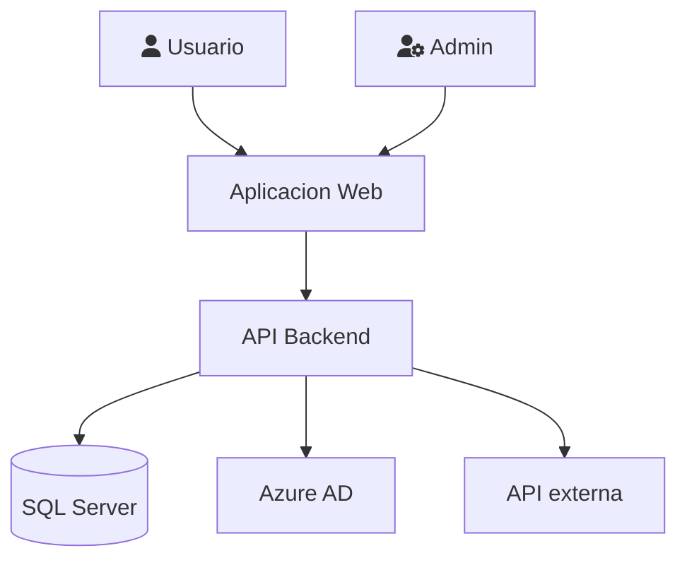
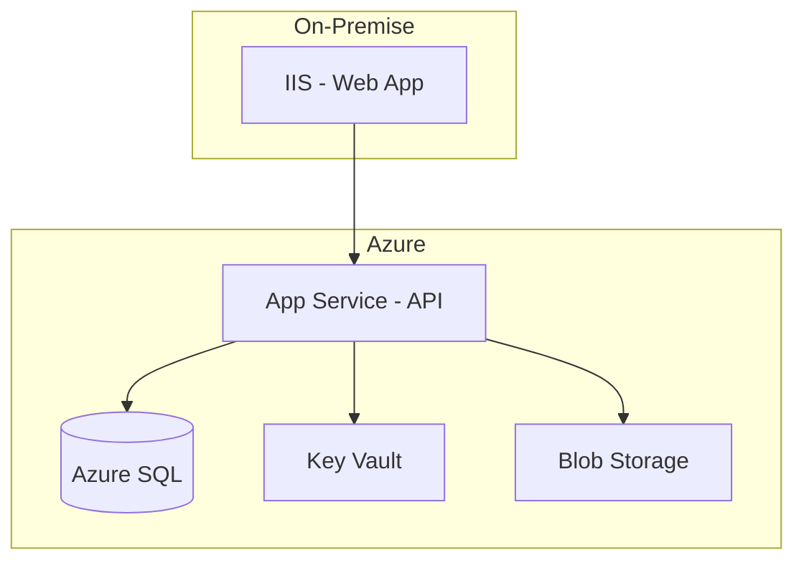

# Guia de Diagramas de Arquitectura

> Skill: analisis-arquitectura | Version: 3.1.0

Guia para crear diagramas de arquitectura usando el modelo C4 y Mermaid.

---

## Modelo C4

| Nivel | Que muestra | Audiencia |
|-------|-------------|-----------|
| Context | Sistema y sus interacciones externas | Todos |
| Container | Aplicaciones y almacenes de datos | Tecnica |
| Component | Componentes internos de un container | Desarrolladores |
| Code | Clases y relaciones | Desarrolladores |

## Nivel 1: Context

## Nivel 2: Container

## Convenciones de Color

| Elemento | Color |
|----------|-------|
| Usuario | Azul claro |
| Sistema propio | Azul |
| Sistema externo | Gris |
| Base de datos | Verde |
| Almacenamiento | Amarillo |

---

*Pattern v3.1.0*
