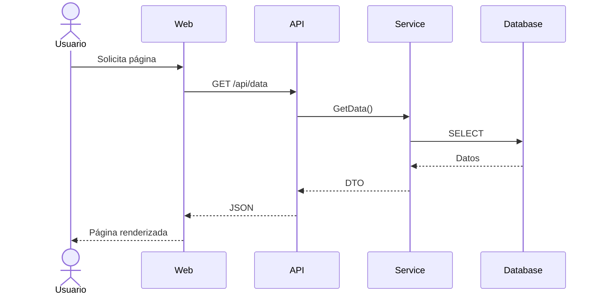
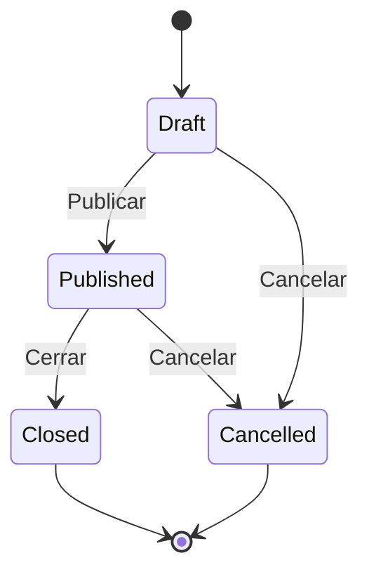
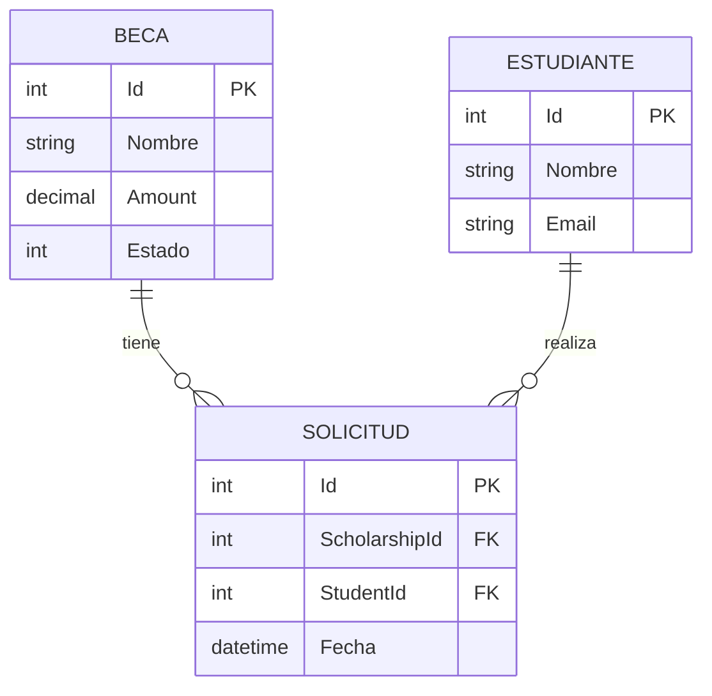

# Documentación Técnica

Este skill genera documentación técnica siguiendo estándares del ecosistema.

---

## Cuándo Usar Este Skill

1. **README** - Documentar proyecto nuevo o existente
2. **ADRs** - Registrar decisiones arquitectónicas
3. **APIs** - Documentar endpoints y contratos
4. **Guías** - Crear guías de instalación/uso
5. **Diagramas** - Generar documentación visual

---

## Activación del Skill

### Por Comando

| Comando | Acción |
|---------|--------|
| `/documentar` | Activa el skill para documentación técnica |
| `/documentar readme` | Genera/actualiza README.md del proyecto |
| `/documentar adr` | Crea nuevo ADR (Architecture Decision Record) |
| `/documentar api` | Documenta endpoints API con plantilla estándar |

> **Nota:** Para documentación de usuario final (guías de uso, manuales), usar `/documentar-uso`

### Por Contexto (Automático)

Claude activa este skill automáticamente cuando detecta:
- Usuario menciona "documentar", "ADR", "README"
- Se pide crear documentación técnica o arquitectónica
- Se trabaja con archivos en carpeta `_hilo/` o `docs/`
- Se necesita generar diagramas Mermaid

---

## Plantillas Disponibles

### README.md

```markdown
# [Nombre del Proyecto]

> Breve descripción del proyecto (1-2 líneas)

## Índice

- [Requisitos](#requisitos)
- [Instalación](#instalación)
- [Configuración](#configuración)
- [Uso](#uso)
- [API](#api)
- [Testing](#testing)
- [Despliegue](#despliegue)
- [Contribución](#contribución)

## Requisitos

- .NET 10 SDK
- SQL Server 2019+
- Node.js 20+ (si aplica)

## Instalación

\```bash
git clone [url]
cd [proyecto]
dotnet restore
\```

## Configuración

### Variables de entorno

| Variable | Descripción | Requerida |
|----------|-------------|-----------|
| `ConnectionStrings__Default` | Cadena de conexión BD | Sí |

### User Secrets (Desarrollo)

\```bash
dotnet user-secrets set "ConnectionStrings:Default" "Server=..."
\```

## Uso

\```bash
dotnet run --project src/Web
\```

## API

Documentación OpenAPI disponible en `/openapi/v1.json`

## Testing

\```bash
dotnet test
\```

## Despliegue

[Instrucciones de despliegue]

## Contacto

- **Equipo:** {{Equipo}}
- **Email:** soporte@example.com
```

---

### ADR (Architecture Decision Record)

```markdown
# ADR-[NÚMERO]: [Título de la Decisión]

## Estado

[Propuesta | Aceptada | Deprecada | Reemplazada por ADR-X]

## Contexto

[Descripción del contexto y problema que motivó la decisión]

## Decisión

[Descripción de la decisión tomada]

## Consecuencias

### Positivas
- [Beneficio 1]
- [Beneficio 2]

### Negativas
- [Inconveniente 1]
- [Inconveniente 2]

### Riesgos
- [Riesgo 1 y mitigación]

## Alternativas Consideradas

### Alternativa 1: [Nombre]
- **Pros:** ...
- **Contras:** ...
- **Motivo de descarte:** ...

## Referencias

- [Enlace 1]
- [Enlace 2]

---

**Fecha:** YYYY-MM-DD
**Autor:** [Nombre]
**Revisores:** [Nombres]
```

---

### Documentación de API

```markdown
# API [Nombre]

## Autenticación

\```http
Authorization: Bearer {token}
\```

## Endpoints

### GET /api/scholarships

Obtiene listado paginado de scholarships.

**Parámetros Query:**

| Parámetro | Tipo | Requerido | Descripción |
|-----------|------|-----------|-------------|
| page | int | No | Página (default: 1) |
| size | int | No | Tamaño (default: 10) |
| estado | string | No | Filtro por estado |

**Respuesta 200:**

\```json
{
  "items": [...],
  "totalItems": 100,
  "page": 1,
  "pageSize": 10,
  "totalPages": 10
}
\```

**Errores:**

| Código | Descripción |
|--------|-------------|
| 401 | No autenticado |
| 403 | Sin permisos |

---

### POST /api/scholarships

Crea una nueva scholarship.

**Request Body:**

\```json
{
  "nombre": "string (requerido, max 200)",
  "descripcion": "string (opcional)",
  "importe": "decimal (requerido, > 0)"
}
\```

**Respuesta 201:**

\```json
{
  "id": 1,
  "nombre": "...",
  "...": "..."
}
\```

**Errores:**

| Código | Descripción |
|--------|-------------|
| 400 | Validación fallida |
| 409 | Conflicto (ya existe) |
```

---

## Diagramas Mermaid

### Diagrama de Secuencia



### Diagrama de Estados



### Diagrama ER



---

## Checklist de Documentación

### Proyecto Nuevo
- [ ] README.md completo
- [ ] CHANGELOG.md iniciado
- [ ] Configuración documentada
- [ ] Variables de entorno listadas
- [ ] Instrucciones de instalación

### API
- [ ] Endpoints documentados
- [ ] Códigos de error explicados
- [ ] Ejemplos de request/response
- [ ] Autenticación explicada

### Arquitectura
- [ ] Diagrama de capas
- [ ] ADRs para decisiones importantes
- [ ] Flujos principales documentados

---

*Skill documentacion-tecnica v3.7.0*
