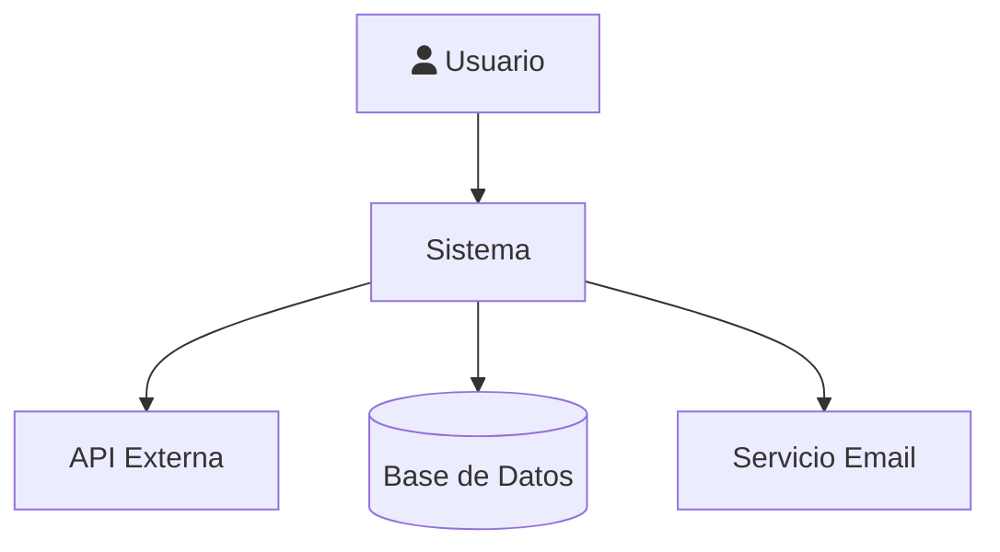
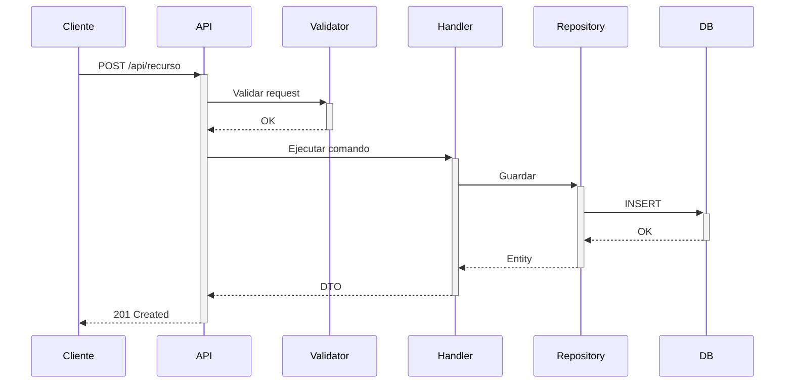
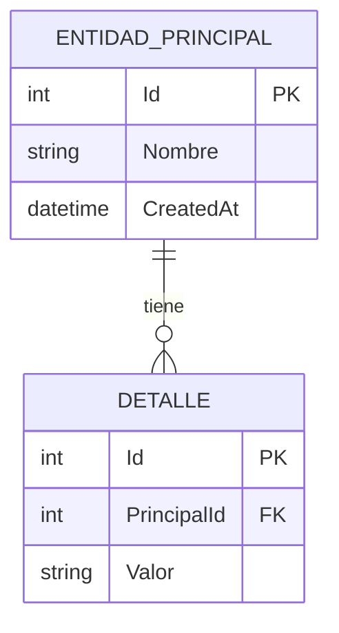
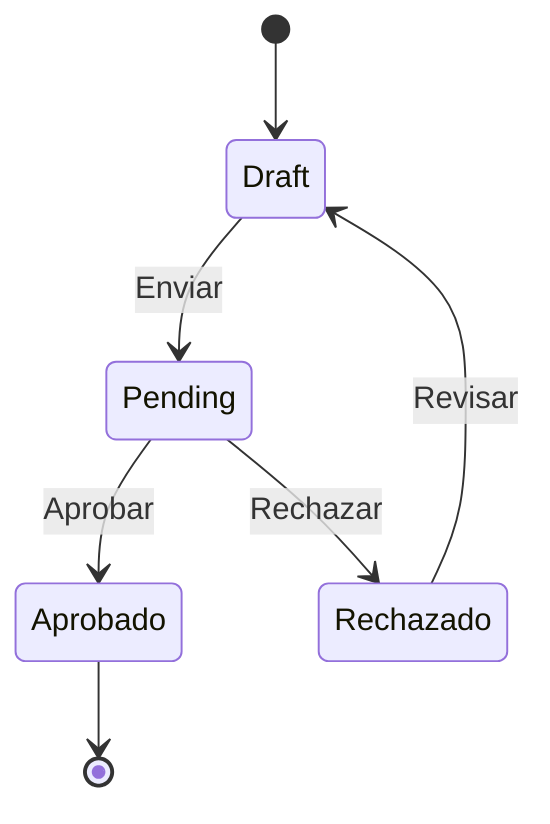

# Catalogo de Diagramas Mermaid

> Skill: documentacion-tecnica | Version: 3.1.0

Diagramas reutilizables para documentacion tecnica de proyectos .NET.

---

## C4 Context

## Sequence - Request API

## ER Diagram

## State Diagram

---

*Pattern v3.1.0*
