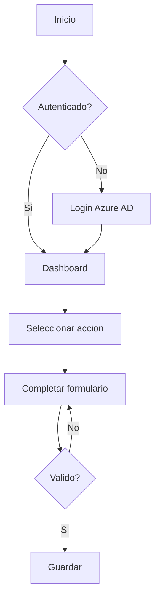

# Guia de Documentacion de Flujos de Usuario

> Skill: user-documentation | Version: 3.1.0

Como documentar flujos de usuario para aplicaciones de la organización.

---

## Mermaid para Flujos

## Estructura de Documentacion

1. **Nombre del flujo** - Accion que realiza el usuario
2. **Prerequisitos** - Permisos, datos previos necesarios
3. **Pasos** - Numerados, con capturas
4. **Resultado esperado** - Que ve el usuario al final
5. **Errores comunes** - Y como resolverlos

## Capturas de Pantalla

- Formato: PNG, 1280x720 minimo
- Nombrar: `flujo-nombre_paso-N.png`
- Anotar con flechas/recuadros rojos los elementos clave
- Almacenar en `screenshots/` del proyecto

---

*Pattern v3.1.0*
