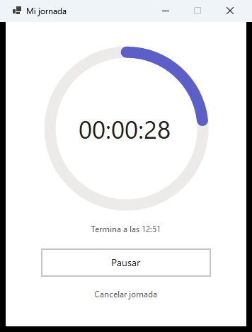
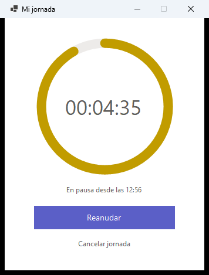
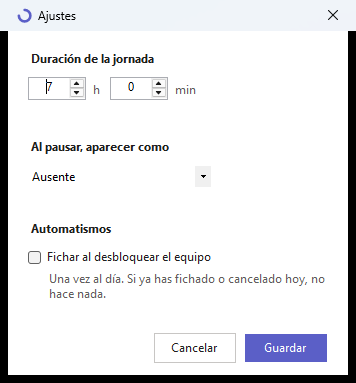

# Mi jornada

Aplicación de escritorio para Windows que pone tu presencia de Teams en **Disponible** al empezar
la jornada y en **Fuera del trabajo** al terminarla, con una cuenta atrás de 7 horas por medio.

El problema que resuelve: **no aparecer disponible fuera del horario de trabajo** sin tener que
acordarse de cambiar el estado a mano.



Habla directamente con Microsoft Graph. Sin Power Platform, sin flujos y sin licencias premium
— fue la tercera implementación de la misma idea, y la primera que no cuesta dinero al mes.

---

## Instalar

```powershell
git clone https://github.com/hvaler/MiJornada
cd MiJornada\scripts
.\instalar.ps1
```

**No hace falta ser administrador.** Instala solo para el usuario actual en
`%LOCALAPPDATA%\Programs\MiJornada`. Por defecto publica un `.exe` autocontenido, así que funciona
en un equipo sin .NET instalado. Detalles y opciones: [`scripts/README.md`](scripts/README.md).

La primera vez pide un **código de dispositivo**: se copia, se pega en el navegador y no lo vuelve
a pedir. No es un capricho — el flujo interactivo normal no funciona en equipos no gestionados por
el tenant, y eso está documentado en `_hilo/DECISIONES.md` (ADR-002).

---

## Qué hace

| | |
|---|---|
| **Iniciar jornada** | Presencia a `Available` y cuenta atrás de 7 h (configurable, y distinta por día si quieres) |
| **Pausar / Reanudar** | Congela el restante y pone el estado que elijas. Al reanudar, la hora de fin se desplaza |
| **Fin de la cuenta** | Presencia a `Offline`/`OffWork` — lo que Teams muestra como Fuera del trabajo |
| **Cancelar** | Da la jornada por no ocurrida y **suelta** la presencia: Teams vuelve a calcularla sola |

Y alrededor de eso:

- **Anillo de progreso** que cuenta lo que queda, también dibujado en el icono de la bandeja, para
  verlo sin abrir la ventana.
- **Fichaje automático al desbloquear el equipo**, con franja horaria, fines de semana y festivos.
  Es lo que convierte esto en algo de lo que no hay que acordarse.
- **Estado compartido entre equipos** por la carpeta de aplicación de OneDrive: si empiezas la
  jornada en el portátil y abres la aplicación en otro equipo, ves la cuenta atrás en marcha, no
  un botón de «Iniciar» que arrancaría una segunda jornada.
- **Histórico de jornadas** con resumen semanal.
- **Avisos** al empezar y terminar, con uno de 48 mensajes y su emoji. Son ventanas propias y
  no globos de bandeja, porque con **No molestar** Windows descarta los globos sin dejar rastro.

<p align="center">
  
  
</p>

---

## Cómo está hecho

.NET 8 + WinForms, con el anillo dibujado a mano con GDI+. Dos paquetes NuGet (MSAL) y ninguna base
de datos: el estado es un JSON en `%APPDATA%\MiJornada`.

**Sin capas, sin interfaces y sin inyección de dependencias**, con un namespace plano. Es una
excepción deliberada a los estándares del ecosistema, no un descuido: ver `_hilo/DECISIONES.md`
(ADR-007) antes de "corregirlo". Ese ADR tiene además una revisión honesta — nació justificándose
con «son 500 líneas» y hoy son ~3.600.

```
/                       La aplicación, en la raíz: 13 ficheros .cs, el .csproj y el icono
scripts/                Instalador, desinstalador, registro en Entra y generador del icono
docs/                   Capturas, documentos de traspaso y LEEME original
_hilo/                  Memoria del proyecto: decisiones, lecciones, deuda
```

### Dónde está lo interesante

Casi todo lo que costó descubrir está escrito, no en el código sino en `_hilo/`:

- **`_hilo/DECISIONES.md`** — 11 ADRs, varios tomados **después** de probar la alternativa y que
  fallara.
- **`_hilo/LECCIONES.md`** — lo que costó horas: que `setUserPreferredPresence` no hace nada y no
  falla si Teams está cerrado; que la ruta `/me/...` devuelve 404 con cuerpo vacío; que con No
  molestar Windows descarta los globos de bandeja; que GDI pinta los emoji en monocromo.
- **`_hilo/DEUDA_TECNICA.md`** — lo que se sabe que está a medias, con su porqué.
- **`_hilo/FUNCIONALIDADES.md`** — los 18 módulos, cada uno con las decisiones que no se ven
  leyendo el código.

---

## Requisitos

- Windows 10 o 11
- Cuenta de Microsoft 365 de la organización
- **Teams abierto en algún dispositivo**: sin una sesión de presencia activa, la llamada a Graph
  responde correctamente y no cambia nada. Es un fallo silencioso y conviene saberlo
- Permisos delegados `Presence.ReadWrite` y `Files.ReadWrite.AppFolder`, ninguno de los dos
  necesita consentimiento de administrador

---

## Sobre la estructura del repositorio

Estructura de proyecto .NET convencional: **la aplicación en la raíz**, `scripts/` para instalar y
`docs/` para el resto (ADR-011). Nació sobre la plantilla del ecosistema **Ovillo** — carpetas de
fase numeradas y ~460 ficheros de andamio que llegaron a ser el 86 % del repositorio — y se
desmontó en dos pasos: primero dejó de versionarse (ADR-010) y después se retiró también de la
copia de trabajo, porque Ovillo pasará a usarse **como plugin de Claude Code**.

La memoria del proyecto (`_hilo/`: decisiones, lecciones, deuda) sí se versiona: es contenido,
no herramienta. Un clon recién hecho compila y funciona como cualquier proyecto .NET.

---

*Herramienta personal. Ver `_hilo/ESTADO_PROYECTO.json` para el estado actual.*
